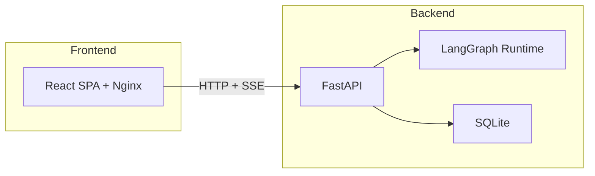
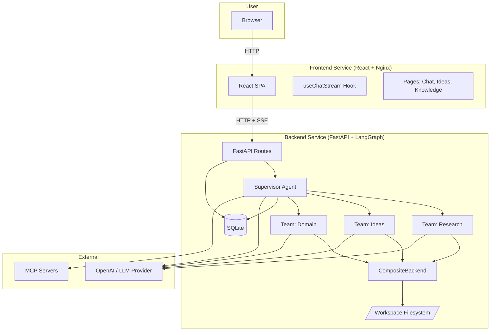
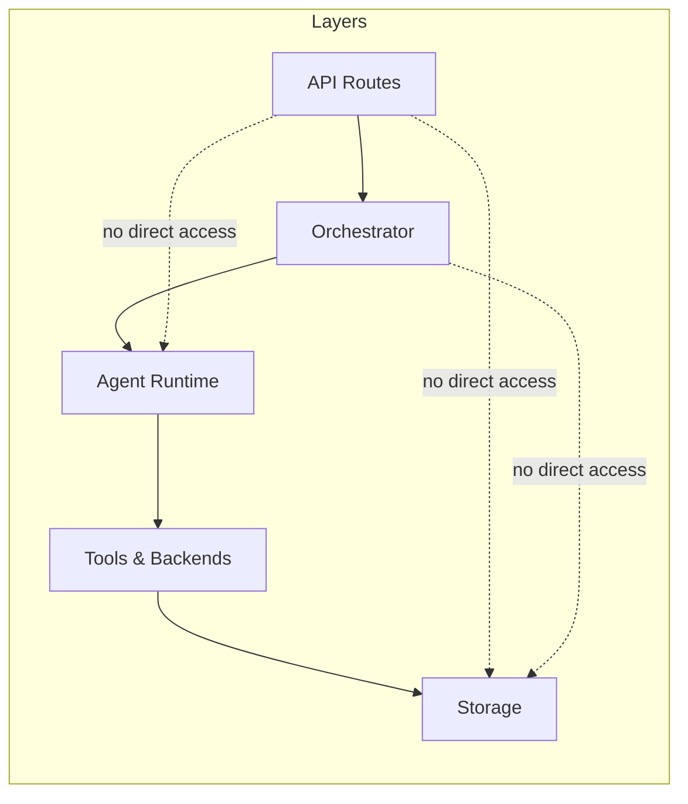

# Architecture Spine — Companion

## Design Paradigm

**LangGraph Supervisor + DeepAgents Teams** — a supervisor-agent orchestrates domain-specialist teams, where each team is a LangGraph subgraph with DeepAgents-equipped agents. The supervisor routes user intent to the right team via tool calling; teams execute autonomously and return structured results.

| Paradigm Layer | Namespace |
|---|---|
| Supervisor (intent router) | `backend/app/orchestrator/` |
| Team subgraphs | `backend/app/agent/teams/` |
| Agent runtime & tools | `backend/app/agent/` |
| API surface | `backend/app/api/routes/` |
| State & persistence | `backend/app/state/`, `backend/app/storage/` |
| Frontend chat & pages | `frontend/src/pages/`, `frontend/src/hooks/` |

## Invariants & Rules

### AD-1 — LangGraph + DeepAgents as Sole Orchestration [ADOPTED]

- **Binds:** all agent execution, state management, streaming, tool calling
- **Prevents:** dual-paradigm drift (old FSM transitions lib coexisting with LangGraph)
- **Rule:** All agent orchestration uses LangGraph graphs + DeepAgents agents. The `transitions` library, YAML-based state persistence (`backend/app/state/fsm_*.py`), and custom SSE event bus are **dead code** — do not import, extend, or reference. New features build exclusively on LangGraph `StateGraph`, `CompiledGraph`, and DeepAgents `Agent` primitives.

### AD-2 — 2-Service Split: Frontend + Backend (In-Process LangGraph) [ADOPTED]

- **Binds:** deployment topology, process boundaries, inter-service communication
- **Prevents:** microservice sprawl (3+ services) for a solo developer
- **Rule:** The system ships as exactly two services: (1) Frontend — React/Vite SPA served by Nginx, (2) Backend — FastAPI with LangGraph running in-process. LangGraph is a library, not a separate microservice. Services communicate via HTTP/SSE only. No message queues, no service mesh.



### AD-3 — SQLite via SqliteSaver as Sole Persistence [ADOPTED]

- **Binds:** database layer, checkpoint storage, data access
- **Prevents:** premature Postgres migration adding operational complexity
- **Rule:** SQLite is the sole database. LangGraph checkpoints use `SqliteSaver`. Application data uses SQLite via SQLAlchemy. `SqliteSaver` is a **single global singleton** — creating new connections causes `database is locked`. Postgres migration happens only when measurable bottlenecks are hit (connection contention, WAL lock waits > 100ms p99).

### AD-4 — CompositeBackend with Route-Based Filesystem Access [ADOPTED]

- **Binds:** agent filesystem operations, tool permissions, workspace access
- **Prevents:** agents reading/writing arbitrary paths outside the workspace
- **Rule:** All agent filesystem access goes through `CompositeBackend` with explicit route mappings. Agents cannot access paths outside their configured workspace root. MCP tools **bypass** the CompositeBackend permissions model — this is a known gap tracked for future hardening.

### AD-5 — astream(version="v2") as Sole Streaming API [ADOPTED]

- **Binds:** all streaming endpoints, SSE routes, frontend chat hooks
- **Prevents:** code that references incompatible streaming APIs or version parameters
- **Rule:** `graph.astream(input, version="v2")` is the **only** streaming API for LangGraph 0.6.x. Do not use `stream_events(version="v3")` — that API exists only in LangGraph 1.2+ and is incompatible with the pinned 0.6.x stack. Frontend uses custom React hooks (`useChatStream`) over SSE. No `langchain-react` or AI SDK. If the stack upgrades to LangGraph 1.2+, this AD must be amended to adopt `stream_events(version="v3")` before writing new streaming code.

### AD-6 — Workspace Filesystem as Source of Truth [ADOPTED]

- **Binds:** data persistence, file storage, idea/workspace data
- **Prevents:** premature dual-write (filesystem + database) migration complexity
- **Rule:** Workspace filesystem is the source of truth for ideas, research artifacts, and agent outputs. Database stores runtime state only (active threads, checkpoints, user preferences). Database migration for persistent data is deferred until after LangGraph migration is stable.

### AD-7 — Dynamic Team/Agent Configuration from YAML [ADOPTED]

- **Binds:** team definitions, agent registration, runtime configuration
- **Prevents:** hardcoded team/agent structures requiring code changes
- **Rule:** Team and agent definitions live in `config/teams.yaml`. Teams are loaded at startup and can be reloaded without full restart. Each team defines: name, agents, tools, subgraph structure, and routing keys. Runtime state (active threads, work items) lives in the database.

### AD-8 — MCP Architecture: HTTP User-Configurable + Stdio Platform-Level [ADOPTED]

- **Binds:** MCP server configuration, tool discovery, connector framework
- **Prevents:** hardcoded MCP servers or insecure stdio spawning from user input
- **Rule:** `config/mcp.json` holds platform-level MCP server definitions (both stdio and HTTP). Users can add **HTTP-only** MCP servers via the UI (stored in database). Stdio MCP servers require platform-level configuration in `config/mcp.json`. Future connector framework for Slack, Gmail, Drive, Calendar, Azure DevOps, Firebase, GitHub, Perplexity.

### AD-9 — No Sandbox / Code Execution [ADOPTED]

- **Binds:** code execution, sandboxing, agent tool safety
- **Prevents:** scope creep into sandbox infrastructure (container runtime, seccomp, resource limits)
- **Rule:** No code execution sandbox. Agents cannot execute arbitrary code. DeepAgents file tools (read, write, delete) operate within CompositeBackend boundaries only. Code execution capability is deferred until post-migration stability.

### AD-10 — HITL Interrupts for Filesystem Mutations [ADOPTED]

- **Binds:** destructive agent operations, file write/delete, HITL workflow
- **Prevents:** agents silently overwriting or deleting user files
- **Rule:** Filesystem mutations (write, delete, overwrite) trigger LangGraph `Command`-based interrupts requiring human approval. Frontend presents approval/rejection UI via SSE. Read operations do not require approval.

### AD-11 — LangGraph Security: STRICT_MSGPACK [ADOPTED]

- **Binds:** LangGraph serialization, checkpoint storage, deserialization safety
- **Prevents:** arbitrary code execution via malicious checkpoint data
- **Rule:** `LANGGRAPH_STRICT_MSGPACK=true` is mandatory in all environments. Application startup validates this env var is set and **fails fast** if missing. `allowed_msgpack_modules` may be used as a complement but never as a substitute — the env var is the single enforced policy.

### AD-12 — Deprecated Modules Are Dead Code [ADOPTED]

- **Binds:** entire codebase, import graph, build validation
- **Prevents:** new code importing deprecated modules, thinking they're maintained
- **Rule:** The following modules are dead code and must not be imported by new code:
  - `backend/app/state/fsm_*.py` — FSM state machines
  - `backend/app/orchestrator/transitions.py` — transitions library usage
  - `backend/app/scheduler.py` — old workflow scheduler
  - `backend/app/scoring/` — old scoring pipeline (replaced by agent tools)
  - `backend/app/research/` — old research pipeline (replaced by agent teams)
  - `config/system-config.yaml` — old FSM state definitions
  - Any file marked `DEPRECATED` in `docs/architecture.md`
- **Enforcement:** CI pipeline must run a forbidden-import check (e.g., `grep -r` or `ruff` per-file-ignores) that fails the build on any import of listed dead modules.

### AD-13 — Canonical Entity Ownership [ADOPTED]

- **Binds:** data persistence layer, all entity CRUD operations
- **Prevents:** two units owning the same entity type with different storage backends
- **Rule:** Each entity type has exactly one canonical owner and storage backend:

| Entity | Canonical Owner | Storage | Written Via |
|---|---|---|---|
| `idea` | Ideas team | Workspace filesystem | CompositeBackend |
| `research_artifact` | Research team | Workspace filesystem | CompositeBackend |
| `thread` | Thread API | SQLite | SQLAlchemy repository |
| `checkpoint` | LangGraph runtime | SQLite | SqliteSaver singleton |
| `team_definition` | Config loader | `config/teams.yaml` | File read at startup/reload |
| `mcp_server` (platform) | Config loader | `config/mcp.json` | File read at startup |
| `mcp_server` (user) | MCP API | SQLite | SQLAlchemy repository |
| `user_preference` | Auth API | SQLite | SQLAlchemy repository |
| `approval_request` | HITL middleware | SQLite | SQLAlchemy repository |

No other layer may persist that entity's primary fields. Cross-layer reads are allowed; cross-layer writes are forbidden.

### AD-14 — Config Loading Precedence [ADOPTED]

- **Binds:** startup initialization, config reload, runtime configuration
- **Prevents:** two teams loading different effective configs from the same inputs
- **Rule:** Configuration loads in this strict order (later layers overlay earlier ones):
  1. `config/teams.yaml` — platform team/agent definitions (authoritative base)
  2. `config/mcp.json` — platform MCP server definitions (authoritative base)
  3. Database overlay — user-added HTTP MCP servers, runtime preferences
  4. Environment variables — secrets, overrides (highest precedence)

Config reload merges DB overlay on top of the file base. File changes require explicit reload trigger (API endpoint or SIGHUP). All config schemas are versioned (`schema_version` field) and validated on load — invalid schema fails fast at startup.

### AD-15 — In-Process Background Work Only [ADOPTED]

- **Binds:** background execution, scheduling, async tasks
- **Prevents:** overlapping background execution paths (separate workers, pollers, schedulers)
- **Rule:** All background work runs in-process within the FastAPI backend. No separate worker processes, no Celery/RQ, no external schedulers. Async tasks use `asyncio.create_task` or FastAPI background tasks. The old `backend/app/scheduler.py` is dead code (AD-12).

### AD-16 — Two-Lane Release Machine: develop = beta, main = production [ADOPTED]

- **Binds:** all release automation, versioning, changelog generation, branch/merge policy
- **Prevents:** hand-rolled version bumps, tag drift between lanes, changelog drift, version numbers that lie about what shipped
- **Rule:**
  - **Lanes & merge method.** `develop` = beta lane, `main` = production lane. PR-only workflow; direct pushes to develop are forbidden. Any branch → `develop`: **squash** merge with a Conventional-Commit title. `develop` → `main`: **merge commit only** (never squash/rebase — release-please reads the PR's commit range, and a squashed empty diff produces a useless Release PR). Hotfixes are cut from `main`, fixed there with a `fix:` squash, then back-merged into `develop`.
  - **Version law (commit-derived, `bump-minor-pre-major` on).** `fix:`/`perf:` → patch · `feat:` → minor · breaking marker (`!:` / `BREAKING CHANGE:`) → **minor while base < 1.0.0**, major at ≥ 1.0.0. The default is always commit-derived; "no label = patch" is explicitly rejected (it would silently ship features as patches).
  - **First-release declaration (owner, 2026-08-16).** The first production release is declared **v1.0.0**, carried by a `chore(release)` commit with the `Release-As: 1.0.0` footer (the only machine override; newest wins). Pre-declaration betas on develop compute from base 0.0.0 (v0.1.0-beta.N) and are the honest pre-release state; once v1.0.0 tags on main, betas continue as 1.x. Flip side to live with: at ≥ 1.0.0 a `!:`/`BREAKING CHANGE:` commit auto-bumps **major** (2.0.0) — breaking changes must be deliberate from day one.
  - **Beta lane (fully automated).** Every merge to `develop` auto-cuts `vX.Y.Z-beta.N` (N = count of existing beta tags for that base) plus a GitHub prerelease: `.github/workflows/release-beta.yml` + `.github/scripts/beta-version.sh` (shared version brain, branch-agnostic).
  - **Production lane (one human act).** A `develop`→`main` merge triggers release-please (`.github/workflows/release-prod.yml`, `.release-please-config.json`, `.release-please-manifest.json`), which opens a Release PR (version tag + `CHANGELOG.md` + GitHub Release). **Merging that Release PR is the release.**
  - **Prediction & mismatch alarm.** `.github/workflows/release-preview.yml` comments the predicted production version + commit breakdown on every `develop`→`main` PR before merge, and raises a ⚠️ mismatch alarm when a `release:major|minor|patch` label disagrees with the commit-derived level.
  - **Labels are human-only.** `release:major` / `release:minor` / `release:patch` are project-board planning tools. The release engine never reads labels (verified against release-please source: zero label references in the versioning strategy). The only machine inputs are conventional commits and `Release-As:` footers (newest wins).
  - **Defects & milestones.** Defects enter release notes via `Closes #N` in the fix PR. Milestones: one per production version (the first is `v1.0.0`), never per beta.
  - **Parked.** Container image build/push is deferred — reserved slot in both workflows; no image-registry answer yet.
- **Enforcement:** workflows + merge-method table in `.github/pull_request_template.md`. Do **not** enable "Require linear history" on `main` — it forbids the merge commits this policy depends on. If an empty-changelog Release PR appears, the wrong merge method was used: close it and re-merge correctly.

### AD-17 — Work-Item Hierarchy & Project-Management Model [ADOPTED]

- **Binds:** how all GitHub issues, milestones, environments and board items are created and linked; how BMAD artifacts relate to the project board
- **Prevents:** orphan work items, board↔BMAD drift, untraceable defects, milestone sprawl
- **Rule:**
  - **Two layers, one truth.** The GitHub repo + project board ("Group Run", project #4) is the **work-item truth**: every feature, fix, task and bug is an issue. BMAD in-repo artifacts (epics.md, story files, sprints) are the **thinking layer** — they produce issues, then the issue is the work item. No auto-sync tooling exists (BMAD↔GitHub sync module: verified absent, 2026-08); sync is done by agent/human via `gh`.
  - **Hierarchy = GitHub sub-issues (2 layers, 1 truth).** Epic (root) → Story (sub-issue of Epic) → Task or Bug (sub-issue of Story); a Bug may be a direct child of an Epic. Defect in a shipped version = Bug under the owning Epic, milestone = the release being fixed (hotfix path per AD-16). The board renders hierarchy natively via its `Parent issue` + `Sub-issues progress` fields; the `Issue Type` field reflects the repo issue type (Epic/Story/Task/Bug) once configured repo-level — until then, `epic`/`story` labels mark type.
  - **Milestones = production releases only**, never per beta (AD-16). Owner decision 2026-08-16: **v1.0.0 is the first release and the only milestone** — every Sprint-1 + Sprint-2 work item carries v1.0.0; the v0.1.0 and v0.2.0 milestones were deleted. Betas are tag-only (`vX.Y.Z-beta.N`) and never get milestones.
  - **Environments = release lanes.** `beta` (develop lane) and `production` (main lane); the release workflows target them. Add required reviewers once the first deploy actions land (image builds parked per AD-16).
  - **Branch protection.** Both branches already require the 5 quality checks (backend lint/tests, frontend lint/tests/build), strict mode. The Playwright e2e check (PR #14) must be added to `main`'s required checks once verified.
- **Enforcement:** convention + PR template. Issues created outside the hierarchy get re-parented/re-milesstoned at triage; Jules-delegated issues always carry an owning Epic parent.

## Consistency Conventions

| Concern | Convention |
|---|---|
| **Naming — entities** | Snake_case for Python, camelCase for TypeScript/JS, PascalCase for React components |
| **Naming — files** | Snake_case for Python modules, kebab-case for frontend components, `useVerb` for React hooks |
| **Naming — events** | `noun.verb` pattern (e.g., `idea.created`, `thread.updated`, `agent.interrupted`) |
| **IDs** | UUIDs v4 for all entities. No auto-increment integers for public IDs. |
| **Dates** | ISO 8601 with timezone (`2026-08-02T14:00:00+05:30`). Never naive datetimes. |
| **Error shape** | `{"error": {"code": "STRING", "message": "Human readable", "details": {}}}` |
| **API responses** | No envelope wrapping. Direct data return. Errors use standard error shape. |
| **State mutation — agent state** | LangGraph `StateGraph` with typed `State` models. Written only via graph reducers. No direct DB writes. |
| **State mutation — runtime state** | Threads, checkpoints, preferences, approvals written via SQLAlchemy repositories. Not via LangGraph reducers. |
| **State mutation — transactional boundary** | Agent graph runs are atomic (LangGraph checkpoint). Runtime state writes happen before/after graph execution, not mid-step. |
| **Logging** | Structured JSON logging. `structlog` for Python, `console` for frontend. Level: INFO production, DEBUG development. |
| **Config** | Environment variables for secrets. YAML/JSON for structured config. No hardcoded secrets. All config schemas include `schema_version` field. |
| **Auth** | API key authentication for backend. Session-based for frontend auth (deferred: JWT migration). |
| **File paths** | `APP_ROOT_DIR` env var pins workspace root in Docker. Never use `pathlib.Path(__file__).parent` for workspace resolution. |

## Stack

### Backend

| Name | Version |
|---|---|
| Python | 3.12 |
| FastAPI | 0.115.x |
| LangGraph | 0.6.x (current working) |
| DeepAgents | 0.6.8 |
| LangChain | 1.3.x |
| langchain-openai | 1.4.x |
| langchain-mcp-adapters | 0.3.x |
| SQLAlchemy | 2.0.x |
| Pydantic | 2.x |
| uvicorn | 0.34.x |
| httpx | 0.28.x |

### Frontend

| Name | Version |
|---|---|
| React | 18.3.x |
| Vite | 5.4.x |
| TypeScript | 5.5.x |
| Tailwind CSS | 3.4.x |
| shadcn/ui | current |
| React Router | 6.x |

### Infrastructure

| Name | Version |
|---|---|
| Docker | 24.x+ |
| Docker Compose | 2.x |
| Nginx | latest stable |
| SQLite | 3.x (via Python stdlib) |

## Structural Seed

### System Container View



### Dependency Direction



**Rule:** Dependencies flow downward only. API routes call orchestrator, orchestrator calls agent runtime, agents use tools/backends. No skip-level access.

### Source Tree

```text
ideator/
  backend/
    app/
      api/
        routes/           # FastAPI route modules
          chat.py         # Chat streaming endpoints
          ideas.py        # Idea CRUD endpoints
          threads.py      # Thread management
          config.py       # MCP/team config endpoints
      orchestrator/       # Supervisor agent + intent routing
        supervisor.py     # Main supervisor graph
        router.py         # Intent classification + team routing
      agent/
        runtime.py        # DeepAgents factory
        backends.py       # CompositeBackend configuration
        teams/            # Team subgraphs (dynamic from YAML)
          research/       # Research team
          ideas/          # Ideas team
          domain/         # Domain-specific teams
        tools/            # Shared agent tools
          filesystem.py   # File read/write with permissions
          mcp.py          # MCP tool adapter
          memory.py       # Agent memory tools
      state/              # LangGraph state models
      storage/            # Database models + repositories
      config.py           # App configuration
      main.py             # FastAPI entry point
    requirements.txt
  frontend/
    src/
      api/                # API client functions
      components/         # Shared UI components
      hooks/
        useChatStream.ts  # SSE streaming hook
        useThreadManager.ts
      pages/
        Chat.tsx          # Main agentic chat
        Ideas.tsx         # Ideas list/detail
        Knowledge.tsx     # Knowledge base
      context/            # React context providers
      types/              # TypeScript interfaces
      App.tsx
      main.tsx
    package.json
  config/
    teams.yaml            # Team/agent definitions
    mcp.json              # MCP server configurations
  docker-compose.yml
  Dockerfile.backend
  Dockerfile.frontend
```

## Capability → Architecture Map

| Capability | Lives In | Governed By |
|---|---|---|
| Agentic AI Chat | `backend/app/orchestrator/`, `frontend/src/pages/Chat.tsx` | AD-1, AD-5, AD-15 |
| Tool Calling | `backend/app/agent/tools/` | AD-1, AD-4 |
| Agent Memory | `backend/app/agent/tools/memory.py`, SQLite checkpoints | AD-1, AD-3, AD-13 |
| Agent Skills | `backend/app/agent/teams/` (per-team tools) | AD-1, AD-7 |
| HITL Approval | `backend/app/agent/backends.py` (interrupts), frontend SSE | AD-10, AD-5, AD-13 |
| Ideas Management | `backend/app/agent/teams/ideas/`, `frontend/src/pages/Ideas.tsx` | AD-1, AD-7, AD-13 |
| Research | `backend/app/agent/teams/research/` | AD-1, AD-7, AD-13 |
| MCP Integration | `backend/app/agent/tools/mcp.py`, `config/mcp.json` | AD-8, AD-13, AD-14 |
| Workspace Filesystem | `backend/app/agent/backends.py` (CompositeBackend) | AD-4, AD-6, AD-13 |
| Dynamic Teams | `config/teams.yaml`, `backend/app/agent/runtime.py` | AD-7, AD-14 |
| Streaming | `backend/app/api/routes/chat.py`, `frontend/src/hooks/useChatStream.ts` | AD-5 |
| Thread Management | `backend/app/api/routes/threads.py`, SQLite | AD-3, AD-13 |
| Knowledge Base | `backend/app/agent/teams/`, workspace filesystem | AD-6, AD-13 |

## Deferred

| Decision | Why It Can Wait | Revisit Condition |
|---|---|---|
| **Postgres migration** | SQLite sufficient for solo dev + small team. No measurable bottleneck yet. | Connection contention, WAL lock waits > 100ms p99, or multi-instance deployment need |
| **Code execution sandbox** | High complexity (container runtime, seccomp, resource limits). Not needed for core chat/ideas flow. | User requests agent code execution feature |
| **Major version upgrades** (React 19, Tailwind 4, Vite 8, DeepAgents 0.7, LangGraph 1.2) | Current versions work. Breaking changes add migration risk. | Quarterly review — upgrade if security patches or critical bugs |
| **JWT authentication** | Session-based auth sufficient for now. | Multi-tenant deployment or mobile API consumers |
| **Database-backed persistent data** | Workspace filesystem works. Dual-write adds complexity. | After LangGraph migration is stable and tested |
| **Connector framework** (Slack, Gmail, Azure DevOps, etc.) | MCP covers the integration pattern. Specific connectors are feature work, not architecture. | User requests specific connector |
| **Sandbox for agent code execution** | Security and complexity not justified yet. | User requests agent-generated code execution |
| **Multi-tenant support** | Solo dev + small team doesn't need it. | Product requires tenant isolation |
| **Observability stack** (OpenTelemetry, Grafana) | Console logging + FastAPI docs sufficient for now. | Production deployment with SLA requirements |
| **Deployment automation (container image build/push)** | Versioning + release automation now covered by AD-16; image registry not yet decided. | Registry/provider answer exists |
