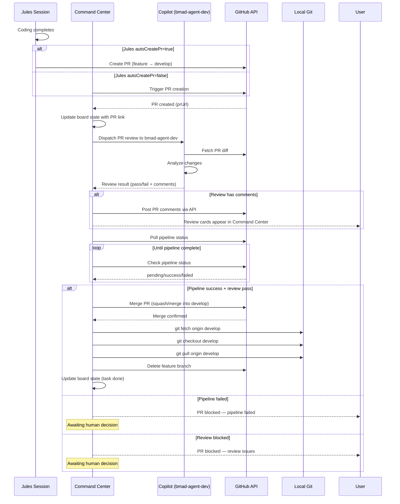

# PR Lifecycle — Command Center Orchestrator

**Project:** Companion  
**Author:** Winston (System Architect)  
**Date:** 2026-08-13  
**Status:** Proposed  

---

## Branch Strategy

```
main (production)
  ↑
develop (integration) ← all feature branches merge here
  ↑   ↑   ↑
feat/a  feat/b  feat/c  (deleted after merge)
```

**Rules:**
- Feature branches: `feat/<story-key>-<short-description>`
- Feature branches merge → `develop`
- `develop` merges → `main` (only when release-ready)
- **NEVER auto-delete `main` or `develop`**
- **DO delete feature branches after merge to `develop`**
- Command Center always pulls `develop` after merges

---

## Complete PR Lifecycle



---

## Phase 1: PR Creation

### Option A: Jules Auto-Creates (Default)

```javascript
// dispatch_to_jules action
session = await jules.createSession({
    prompt: taskPrompt,
    title: sessionTitle,
    sourceId: sourceId,
    branch: `feat/${storyKey}-${slugify(taskTitle)}`,
    autoCreatePr: true,        // Jules creates PR on completion
    requirePlanApproval: true,
});
```

**Jules PR format:**
- Source: `feat/<story-key>-<task-slug>`
- Target: `develop`
- Title: `[BMad] <task title>`
- Body: Includes acceptance criteria from story spec

### Option B: Command Center Triggers

If `autoCreatePr: false`, Command Center creates PR via Copilot session:

```javascript
// When Jules completes without PR
if (julesSession.state === 'COMPLETED' && !julesSession.prUrl) {
    const copilotSession = await createCopilotSession({
        prompt: `
Create a PR for the changes Jules made.
Story: ${storyItem.title}
Task: ${taskItem.title}
Branch: ${julesSession.branch}
Target: develop
        `,
        agent: 'bmad-agent-dev',
    });
}
```

---

## Phase 2: PR Review

### Copilot Review Dispatch

```javascript
async function triggerPRReview(prUrl, storyItem, taskItem) {
    const reviewPrompt = `
You are reviewing a PR created by a Jules coding session.

## PR Details
- URL: ${prUrl}
- Story: ${storyItem.title}
- Task: ${taskItem.title}

## Story Specification (Acceptance Criteria)
${storyItem.body}

## Review Instructions
1. Fetch the PR diff
2. Check that changes satisfy ALL acceptance criteria
3. Check for:
   - Code quality issues
   - Security vulnerabilities
   - Missing error handling
   - Unrelated changes outside scope
   - Missing or broken tests
4. Post comments on specific lines if issues found
5. Return:
   - overall: "pass" | "fail"
   - comments: [{ line, file, comment }]
   - blockingIssues: [{ severity, description }]
`;

    const reviewSession = await createCopilotSession({
        prompt: reviewPrompt,
        agent: 'bmad-agent-dev',
        mode: 'autopilot',
    });

    return reviewSession;
}
```

### PR Comment Injection

```javascript
async function postPRComments(prUrl, comments) {
    for (const comment of comments) {
        // Use GitHub API to post inline comment
        await fetch(`https://api.github.com/repos/azharameen/group-run/pulls/comments`, {
            method: 'POST',
            headers: {
                'Authorization': `Bearer ${GH_TOKEN}`,
                'Accept': 'application/vnd.github.v3+json',
            },
            body: JSON.stringify({
                pull_request_number: extractPRNumber(prUrl),
                path: comment.file,
                line: comment.line,
                body: comment.comment,
            }),
        });
    }
}
```

---

## Phase 3: Pipeline Monitoring

### Pipeline Status Polling

```javascript
const PIPELINE_POLL_INTERVALS = {
    CHECKING:    10000,  // 10s — initial check
    PENDING:     30000,  // 30s — waiting for CI
    IN_PROGRESS: 15000,  // 15s — CI running
    SUCCESS:     null,   // stop polling
    FAILED:      null,   // stop polling
};

class PipelineMonitor {
    constructor(prUrl) {
        this.prUrl = prUrl;
        this.prNumber = extractPRNumber(prUrl);
    }

    async checkStatus() {
        // Check PR checks (GitHub Actions / CI pipelines)
        const response = await fetch(
            `https://api.github.com/repos/azharameen/group-run/repos/commits/${this.prNumber}/check-runs`,
            { headers: { 'Authorization': `Bearer ${GH_TOKEN}` } }
        );
        const checks = await response.json();
        
        // Aggregate status
        const statuses = checks.check_runs?.map(r => r.status) || [];
        const conclusions = checks.check_runs?.map(r => r.conclusion) || [];
        
        if (conclusions.includes('failure') || conclusions.includes('cancelled')) {
            return { status: 'FAILED', details: checks.check_runs };
        }
        if (statuses.every(s => s === 'completed') && conclusions.every(c => c === 'success')) {
            return { status: 'SUCCESS', details: checks.check_runs };
        }
        if (statuses.some(s => s === 'in_progress')) {
            return { status: 'IN_PROGRESS', details: checks.check_runs };
        }
        return { status: 'PENDING', details: checks.check_runs };
    }

    async waitForComplete(onUpdate) {
        while (true) {
            const result = await this.checkStatus();
            onUpdate(result);
            
            if (result.status === 'SUCCESS' || result.status === 'FAILED') {
                return result;
            }
            
            await sleep(PIPELINE_POLL_INTERVALS[result.status] || 30000);
        }
    }
}
```

### Pipeline Status in Command Center

```
┌──────────────────────────────────────────────────────────┐
│  PR #42: [BMad] Implement SQLite concurrent access tests │
├──────────────────────────────────────────────────────────┤
│  Status: 🟠 Pipeline Running                             │
│                                                          │
│  Checks:                                                 │
│  ✅ bmad-code-review     — Passed                        │
│  🟠 ci/lint              — Running (2/5 checks)          │
│  ⏳ ci/test               — Pending                      │
│  ⏳ ci/build              — Pending                      │
│                                                          │
│  Review: ✅ Copilot review passed (0 blocking issues)     │
└──────────────────────────────────────────────────────────┘
```

---

## Phase 4: Auto-Merge Decision

### Merge Criteria

```javascript
async function shouldAutoMerge(prUrl, reviewResult, pipelineResult) {
    // All criteria must be met
    const checks = {
        reviewPassed: reviewResult.overall === 'pass',
        noBlockingIssues: reviewResult.blockingIssues?.length === 0,
        pipelineSuccess: pipelineResult.status === 'SUCCESS',
        targetBranchIsDevelop: extractTargetBranch(prUrl) === 'develop',
    };

    const allPassed = Object.values(checks).every(Boolean);

    if (!allPassed) {
        // Determine why
        const reasons = [];
        if (!checks.reviewPassed) reasons.push('Review failed');
        if (!checks.noBlockingIssues) reasons.push(`${reviewResult.blockingIssues.length} blocking issues`);
        if (!checks.pipelineSuccess) reasons.push('Pipeline failed');
        
        return {
            merge: false,
            reasons,
            blocked: true,
        };
    }

    return { merge: true, reasons: [] };
}
```

### Merge Execution

```javascript
async function mergePR(prUrl) {
    const prNumber = extractPRNumber(prUrl);
    
    // Merge into develop
    await fetch(
        `https://api.github.com/repos/azharameen/group-run/pulls/${prNumber}/merge`,
        {
            method: 'PUT',
            headers: {
                'Authorization': `Bearer ${GH_TOKEN}`,
                'Accept': 'application/vnd.github.v3+json',
            },
            body: JSON.stringify({
                merge_method: 'squash',  // or 'merge', 'rebase'
                commit_title: `[BMad] ${prTitle}`,
            }),
        }
    );

    return { merged: true };
}
```

---

## Phase 5: Post-Merge Actions

### Local Pull and Branch Cleanup

```javascript
async function postMergeActions(prUrl, featureBranch) {
    const result = await shouldAutoMerge(prUrl, review, pipeline);
    if (!result.merge) return;

    // 1. Merge PR
    await mergePR(prUrl);

    // 2. Pull latest develop locally
    await executeGitCommand('git fetch origin develop');
    await executeGitCommand('git checkout develop');
    await executeGitCommand('git pull origin develop');

    // 3. Delete feature branch (NOT main/develop)
    const protectedBranches = ['main', 'develop'];
    if (!protectedBranches.includes(featureBranch)) {
        await fetch(
            `https://api.github.com/repos/azharameen/group-run/git/refs/heads/${featureBranch}`,
            {
                method: 'DELETE',
                headers: { 'Authorization': `Bearer ${GH_TOKEN}` },
            }
        );
    }

    // 4. Update board state
    updateBoardState({
        taskId: associatedTaskId,
        status: 'done',
        prMerged: true,
        mergedAt: new Date().toISOString(),
        branchDeleted: true,
    });

    // 5. SSE event to Command Center
    emitEvent('pr_merged', {
        prUrl,
        featureBranch,
        taskId: associatedTaskId,
        mergedAt: new Date().toISOString(),
    });
}
```

### Local Pull Notification

```
┌──────────────────────────────────────────────────────────┐
│  🔄 Local Sync                                           │
├──────────────────────────────────────────────────────────┤
│  PR #42 merged to develop                                │
│                                                          │
│  ✓ git fetch origin develop                              │
│  ✓ git checkout develop                                  │
│  ✓ git pull origin develop                               │
│  ✓ feature branch feat/s4-1-sqlite-tests deleted         │
│                                                          │
│  Board updated: Task S4.1/T3 → ✅ done                   │
└──────────────────────────────────────────────────────────┘
```

---

## Approval UI: Stacked Cards

### Multiple Pending Approvals

```
┌─────────────────────────────────────────────────────────────────────────────────┐
│  PENDING APPROVALS (3)                          Auto-defer in 2:00 min          │
├─────────────────────────────────────────────────────────────────────────────────┤
│                                                                                 │
│  ┌───────────────────────┐  ┌───────────────────────┐  ┌───────────────────────┐
│  │ ⏸️ Plan Approval       │  │ 💬 Feedback            │  │ 🔍 PR Review           │
│  │                       │  │                       │  │                       │
│  │ Story: S4.1           │  │ Story: S7.1           │  │ Story: S4.1           │
│  │ Task: SQLite tests    │  │ Task: Config loader   │  │ Task: SQLite tests    │
│  │                       │  │                       │  │                       │
│  │ Jules waiting...      │  │ Copilot needs input   │  │ Pipeline green        │
│  │ 1:45 remaining        │  │ 1:32 remaining        │  │ Ready to merge        │
│  │                       │  │                       │  │                       │
│  │ ┌────────┐ ┌────────┐│  │ ┌────────┐ ┌────────┐│  │ ┌────────┐ ┌────────┐│
│  │ │ Approve │ │ Defer  ││  │ │ Reply  │ │ Defer  ││  │ │ Merge  │ │ Block  ││
│  │ └────────┘ └────────┘│  │ └────────┘ └────────┘│  │ └────────┘ └────────┘│
│  └───────────────────────┘  └───────────────────────┘  └───────────────────────┘
│                                                                                 │
└─────────────────────────────────────────────────────────────────────────────────┘
```

### Timer Behavior

```javascript
const APPROVAL_TIMEOUT = 2 * 60 * 1000; // 2 minutes

class ApprovalManager {
    constructor() {
        this.pendingApprovals = new Map(); // itemId → { type, timer, createdAt }
    }

    addApproval(itemId, type, details) {
        const timer = setTimeout(() => {
            this.handleTimeout(itemId, type);
        }, APPROVAL_TIMEOUT);

        this.pendingApprovals.set(itemId, {
            type,    // 'plan_approval' | 'feedback_resolution' | 'pr_merge'
            timer,
            createdAt: new Date(),
            details,
        });

        // SSE event to show card in UI
        emitEvent('approval_needed', {
            itemId,
            type,
            details,
            timeoutRemaining: APPROVAL_TIMEOUT,
        });
    }

    async handleTimeout(itemId, type) {
        const approval = this.pendingApprovals.get(itemId);
        if (!approval) return;

        // Default action: defer
        if (type === 'plan_approval') {
            // Tell Jules to continue with its plan
            await jules.approvePlan(approval.details.sessionName, approval.details.planId);
            this.log(`Auto-approved plan for ${itemId} (timeout — defer)`);
        } else if (type === 'feedback_resolution') {
            // Tell Jules to continue best-effort
            await jules.sendMessage(approval.details.sessionName,
                "Please proceed with your best judgment on this item.");
            this.log(`Auto-deferred feedback for ${itemId} (timeout — continue)`);
        } else if (type === 'pr_merge') {
            // DO NOT auto-merge — keep PR open for manual review
            emitEvent('approval_timed_out', {
                itemId,
                type: 'pr_merge',
                action: 'kept_open',
                message: 'PR merge timed out — kept open for manual review',
            });
        }

        this.pendingApprovals.delete(itemId);
    }

    resolveApproval(itemId, action) {
        const approval = this.pendingApprovals.get(itemId);
        if (!approval) return;

        clearTimeout(approval.timer);
        this.pendingApprovals.delete(itemId);

        // Process the user's decision
        if (action === 'approve' || action === 'merge') {
            // Execute the approved action
        } else if (action === 'defer') {
            // Defer to agent best judgment
        } else if (action === 'block' || action === 'reject') {
            // Block the action
        }
    }
}
```

---

## Complete Session → PR → Merge Flow

```
1. dispatch_to_jules creates session
   └─► Branch: feat/s4-1-sqlite-tests
   └─► autoCreatePr: true

2. Jules codes → completes
   └─► Jules auto-creates PR #42 (feat/s4-1-sqlite-tests → develop)
   └─► prUrl captured in julesSession

3. Command Center detects COMPLETED state
   └─► Triggers PR review via Copilot (bmad-agent-dev)

4. Copilot reviews PR
   └─► Returns: { overall: "pass", comments: [], blockingIssues: [] }
   └─► If issues → posts comments via GitHub API
   └─► Command Center shows review card (if comments exist)

5. Command Center starts pipeline monitoring
   └─► Polls GitHub check runs every 15s
   └─► UI updates with pipeline status

6. Pipeline completes
   └─► If SUCCESS + review pass:
       ├─► Auto-merge PR into develop (squash merge)
       ├─► git fetch origin develop
       ├─► git checkout develop
       ├─► git pull origin develop
       ├─► Delete feat/s4-1-sqlite-tests branch
       └─► Update board: task → done
   └─► If FAILED or review block:
       ├─► Show blocking card in Command Center
       ├─► Awaiting human decision
       └─► No auto-defer for PR blocks (safety)

7. Board refreshes
   └─► Task shows ✅ done with PR link
   └─► Deferred items re-checked (any resolved by this PR?)
```

---

## New Canvas Actions

### PR Management Actions

```javascript
{
    name: "trigger_pr_creation",
    description: "Create a PR for a completed Jules session that didn't auto-create one.",
    inputSchema: {
        properties: {
            itemId: { type: "string" },
            targetBranch: { type: "string", default: "develop" },
        }
    }
},
{
    name: "review_pr",
    description: "Trigger Copilot (bmad-agent-dev) to review a PR and post comments.",
    inputSchema: {
        properties: {
            itemId: { type: "string" },
            prUrl: { type: "string" },
        }
    }
},
{
    name: "merge_pr",
    description: "Merge a PR into develop after review and pipeline pass.",
    inputSchema: {
        properties: {
            itemId: { type: "string" },
            prUrl: { type: "string" },
            mergeMethod: { type: "string", enum: ["squash", "merge", "rebase"], default: "squash" },
        }
    }
},
{
    name: "pull_develop",
    description: "Pull latest changes from develop branch locally.",
    inputSchema: {}
},
{
    name: "delete_feature_branch",
    description: "Delete a feature branch after PR merge (never deletes main/develop).",
    inputSchema: {
        properties: {
            branch: { type: "string" },
        }
    }
},
{
    name: "resolve_approval",
    description: "Resolve a pending approval (approve, defer, reject, merge, block).",
    inputSchema: {
        properties: {
            itemId: { type: "string" },
            action: { type: "string", enum: ["approve", "defer", "reject", "merge", "block"] },
        }
    }
}
```

---

## New SSE Events

```javascript
// PR lifecycle events
{ event: "pr_created", data: { itemId, prUrl, branch, target } }
{ event: "pr_review_started", data: { itemId, prUrl, copilotSessionId } }
{ event: "pr_review_complete", data: { itemId, prUrl, result, comments } }
{ event: "pipeline_status", data: { itemId, prUrl, status, checks } }
{ event: "pr_merged", data: { itemId, prUrl, branchDeleted, mergedAt } }
{ event: "pr_blocked", data: { itemId, prUrl, reasons } }

// Local sync events
{ event: "local_pull", data: { branch, commitSha, message } }
{ event: "branch_deleted", data: { branch } }

// Approval events
{ event: "approval_needed", data: { itemId, type, details, timeoutRemaining } }
{ event: "approval_resolved", data: { itemId, action, resolvedBy } }
{ event: "approval_timed_out", data: { itemId, type, defaultAction } }
```

---

## State Machine: Full Session Lifecycle

```
JULES SESSION:
  QUEUED → PLANNING → AWAITING_PLAN_APPROVAL → IN_PROGRESS → AWAITING_USER_FEEDBACK → IN_PROGRESS → COMPLETED

ON COMPLETED:
  ├─► PR exists? 
  │   ├─► Yes (autoCreatePr) → PR Review → Pipeline → Merge → Cleanup
  │   └─► No (autoCreatePr=false) → Trigger PR Creation → PR Review → Pipeline → Merge → Cleanup

PR REVIEW:
  Copilot (bmad-agent-dev) reviews diff → returns pass/fail + comments

PIPELINE:
  Monitor GitHub check runs → wait for success/failure

MERGE:
  If review pass + pipeline success → auto-merge (squash) into develop
  Else → blocking card in Command Center

CLEANUP:
  git fetch origin develop
  git checkout develop
  git pull origin develop
  delete feature branch (if not main/develop)
  update board state
```

---

## Security Considerations

1. **PR Merge Gate:** Auto-merge only if BOTH review passes AND pipelines green
2. **Protected Branches:** `main` and `develop` are never auto-deleted
3. **Timeout Safety:** PR merge timeouts do NOT auto-merge — kept open for review
4. **Branch Isolation:** Feature branches isolated until merged
5. **Review Audit Trail:** Copilot review results logged with PR

