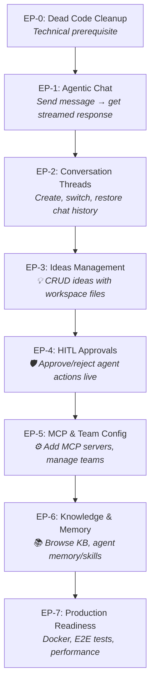

---
stepsCompleted:
  - step-01-validate-prerequisites
inputDocuments:
  - _bmad-output/specs/spec-companion/SPEC.md
  - _bmad-output/specs/spec-companion/entity-ownership.md
  - _bmad-output/specs/spec-companion/stack.md
  - _bmad-output/specs/spec-companion/deferred-decisions.md
  - _bmad-output/planning-artifacts/architecture/architecture-Companion-2026-08-02/ARCHITECTURE-SPINE.md
  - docs/prd.md
  - docs/features.md
  - docs/architecture-decisions.md
  - _bmad-output/project-context.md
codeAuditCompleted: true
codeAuditDate: "2025-08-02"
approach: vertical-slice
approachDate: "2025-08-02"
---

# Companion - Epic Breakdown (Code-Grounded, Vertical-Slice)

> **Sprint 1 — DELIVERED (archived record).** EP-0..EP-7 are complete; see `implementation-artifacts/sprint-status.yaml` for per-story status.
> This file is the archived Sprint 1 backlog (formerly `epics.md`). The active backlog lives in `epics.md` (Sprint 2, EP-8 onward). Epic numbers never restart.

## Overview

This document decomposes the Companion project into **vertical-slice epics** for the LangGraph + DeepAgents migration. Each epic (after Sprint 0) delivers a complete, user-visible feature — backend API, frontend UI, and tests together.

**Current state:** The codebase is a Siemens Patent Ideator (18-state FSM, YAML persistence, custom SSE) that needs to become a general-purpose Agentic Organization Platform. LangGraph is only used for `SqliteSaver` checkpointing — no supervisor graph, no team subgraphs exist yet. The 18-state FSM (`transitions` lib) is the active orchestration engine and must be replaced.

## Sprint Dependency Graph

**Sprint rule:** Each sprint delivers a complete vertical slice — backend API + frontend UI + tests. The user can click and use the feature at the end of every sprint (after Sprint 0). Sprint 0 is the only pure-technical sprint — it removes poisoned imports so nothing else can build.

---

## Cleanup Inventory — Exact Files to Delete

These files serve the old Siemens/FSM paradigm and have NO equivalent in the new architecture. Deleting them is the first story.

### Backend — Dead Code (DELETE)

| File/Directory | Reason | Importers (all also deleted or rewritten) |
|---|---|---|
| `backend/app/state/` (entire dir) | 18-state FSM with `transitions` lib — replaced by LangGraph supervisor | `orchestrator/workflow_tools.py`, `api/app.py`, `tests/test_state_machine.py` |
| `backend/app/scoring/` (entire dir) | Siemens scoring engine — no scoring in new paradigm | `orchestrator/workflow_tools.py`, `tests/test_scoring.py` |
| `backend/app/research/` (entire dir) | Old research adapters (prior art search) — replaced by agent tool calling | `orchestrator/workflow_tools.py`, `tests/test_artifacts_and_research.py` |
| `backend/app/scheduler.py` | APScheduler for auto-generation cycles — no scheduled workflows | `api/app.py` |
| `backend/app/orchestrator/` (entire dir) | Old workflow orchestration (FSM-driven) — replaced by LangGraph | `api/app.py`, `api/routes/*.py`, `agent/runner.py`, `agent/subagents.py` |
| `backend/app/models/siemens.py` | Siemens-specific data models | `models/__init__.py` |
| `backend/app/llm/execution_support.py` | Old LLM execution wrapper (Siemens context) | — |
| `backend/app/llm/subagent_executor.py` | Old subagent executor (Siemens context) | — |
| `backend/app/application/queries/workflow_status.py` | FSM workflow status queries | — |
| `backend/app/api/routes/workflow.py` | FSM workflow route | `api/app.py` |
| `backend/app/api/routes/approval.py` | FSM approval route (gate-based) — replaced by HITL interrupts | `api/app.py` |
| `backend/app/api/routes/config.py` | Siemens config route | `api/app.py` |
| `backend/app/api/routes/streaming.py` | Old SSE streaming (FSM events) — replaced by LangGraph astream | `api/app.py` |
| `config/system-config.yaml` | FSM state definitions | `storage/yaml_io.py` |
| `config/checklist-config.yaml` | Gate checklists | `state/gates.py` |

### Backend — Dead Tests (DELETE)

| File | Reason |
|---|---|
| `backend/tests/test_state_machine.py` | Tests the FSM being deleted |
| `backend/tests/test_scoring.py` | Tests the scoring engine being deleted |
| `backend/tests/test_artifacts_and_research.py` | Tests old research adapters |
| `backend/tests/test_agent_roster.py` | Tests FSM agent-to-state mapping |

### Frontend — Dead Code (DELETE)

| File | Reason |
|---|---|
| `frontend/src/pages/SiemensControls.tsx` | Siemens-specific control page |
| `frontend/src/components/SiemensGateStatus.tsx` | Siemens gate status component |
| `frontend/src/components/ScoreRadar.tsx` | Siemens scoring visualization |
| `frontend/src/constants/gates.ts` | Siemens gate definitions |
| `frontend/src/components/IdeaHistoryTimeline.tsx` | FSM state transition timeline |

---

## Reusable Code Inventory — Files to KEEP

These files work correctly for the new architecture and need minimal or no changes.

### Backend — Reusable

| File | What It Provides | Changes Needed |
|---|---|---|
| `backend/app/agent/runtime.py` | DeepAgents runtime factory with SqliteSaver, CompositeBackend, HITL interrupts, MCP loading | Remove Siemens system prompt default, update subagents source |
| `backend/app/agent/backends.py` | CompositeBackend with route mappings (/workspace/, /kb/, /instructions/, /memories/, /skills/) | None — matches AD-9 |
| `backend/app/agent/permissions.py` | FilesystemPermission rules for agent access | None — matches AD-9 |
| `backend/app/agent/context.py` | DeepAgentContext schema | Review for Siemens-specific fields |
| `backend/app/services/thread_manager.py` | Thread CRUD, SqliteSaver singleton, thread_metadata table, checkpoint message retrieval | None — fully reusable for CAP-4 |
| `backend/app/storage/` (most files) | YAML I/O, workspace management, knowledge base, artifacts, registry | Remove Siemens-specific idea fields, keep filesystem patterns |
| `backend/app/infrastructure/events/stream_bus.py` | SSE event bus (`emit_sse`) | Rewrite to work with LangGraph astream v2 |
| `backend/app/infrastructure/observability.py` | LangSmith tracing configuration | None |
| `backend/app/config.py` | Pydantic Settings, path resolution, credential propagation | Remove FSM-specific settings (scheduler, thresholds, gates) |
| `backend/app/api/routes/health.py` | Health check endpoint | None |
| `backend/app/api/routes/threads.py` | Thread CRUD API (partial — has thread_metadata integration) | Clean up, align with new thread model |
| `backend/app/api/app.py` | FastAPI app factory | Rewrite lifespan, remove dead imports, add new routers |

### Backend — Partially Reusable (MIGRATE)

| File | What to Keep | What to Change |
|---|---|---|
| `backend/app/agent/domain_tools.py` | Filesystem tool definitions | Remove Siemens-specific tool references, remove `score_idea` import |
| `backend/app/agent/runner.py` | Agent execution patterns | Remove `get_machine` import, adapt for LangGraph graph invocation |
| `backend/app/api/routes/chat.py` | Chat message handling | Remove `get_active_idea` import, wire to LangGraph supervisor |
| `backend/app/api/routes/ideas.py` | Idea CRUD patterns | Remove all `workflow_tools` and `workflow` imports, simplify to pure CRUD |
| `backend/app/models/idea.py` | Idea data model | Remove Siemens-specific fields (score, state, gates) |
| `backend/tests/conftest.py` | Test fixtures | Remove FSM/scoring fixtures, add LangGraph mocks |
| `backend/tests/test_threads.py` | Thread API tests | Update for new thread model |
| `backend/tests/test_storage.py` | Storage layer tests | Update for new data models |
| `backend/tests/test_deepagents_integration.py` | DeepAgents integration patterns | Update for new graph structure |
| `backend/tests/test_transcript_events.py` | Event transcript tests | Adapt for LangGraph astream events |

### Frontend — Reusable

| File | What It Provides | Changes Needed |
|---|---|---|
| `frontend/src/hooks/useChatStream.ts` | SSE streaming hook for chat | Update event types for LangGraph astream v2 |
| `frontend/src/hooks/useThreadManager.ts` | Thread CRUD hook | Align with new thread API |
| `frontend/src/pages/Dashboard.tsx` | Main dashboard layout | Remove Siemens references |
| `frontend/src/pages/IdeaDetail.tsx` | Idea detail view | Remove scoring, update for new idea model |
| `frontend/src/pages/KnowledgeBase.tsx` | Knowledge base browser | None |
| `frontend/src/components/app-sidebar.tsx` | App sidebar navigation | Remove Siemens nav items |
| `frontend/src/components/deepagents/AgentTodoPanel.tsx` | Agent todo display | Update event types |
| `frontend/src/components/command-center/CommandCenterWorkspacePane.tsx` | Command center layout | Remove Siemens references |
| `frontend/src/App.tsx` | App routing | Remove Siemens routes |
| `frontend/src/components/site-header.tsx` | Site header | Remove Siemens branding |

---

## Code-Grounded Requirements

Each requirement is tagged:
- **DELETE**: Dead code — must be removed
- **KEEP**: Works as-is, no changes needed
- **MIGRATE**: Exists but needs rewriting for new paradigm
- **NEW**: Does not exist, must be created from scratch

### Functional Requirements

| ID | Requirement | Tag | Code Reference | Epic |
|---|---|---|---|---|
| FR-0.1 | Delete all FSM code (`state/`, `transitions` lib) | DELETE | `backend/app/state/machine.py` imports `from transitions` | EP-0 |
| FR-0.2 | Delete all Siemens-specific backend code | DELETE | `scoring/`, `research/`, `scheduler.py`, `orchestrator/` | EP-0 |
| FR-0.3 | Delete Siemens-specific frontend pages and components | DELETE | 5 files in cleanup inventory | EP-0 |
| FR-0.4 | Delete dead tests and clean conftest | DELETE/MIGRATE | 4 test files, `conftest.py` | EP-0 |
| FR-0.5 | Add forbidden import check to prevent dead code regression | NEW | CI script or ruff rule | EP-0 |
| FR-1.1 | Create `config/teams.yaml` and `config/mcp.json` | NEW | Files do not exist | EP-1 |
| FR-1.2 | Update `config.py` — remove FSM settings, add team/MCP paths, strict msgpack | MIGRATE | `backend/app/config.py` lines 22-27 | EP-1 |
| FR-1.3 | Rewrite `api/app.py` — clean lifespan, new router mounting | MIGRATE | `backend/app/api/app.py` lines 10-13, 31-47 | EP-1 |
| FR-1.4 | Create LangGraph supervisor graph with basic "general" team routing | NEW | No supervisor graph exists | EP-1 |
| FR-1.5 | Wire DeepAgents runtime into supervisor | MIGRATE | `agent/runtime.py`, `agent/subagents.py` | EP-1 |
| FR-1.6 | Rewrite `api/routes/chat.py` — invoke supervisor with astream v2 | MIGRATE | Imports dead `orchestrator.workflow.get_active_idea` | EP-1 |
| FR-1.7 | Rewrite SSE event bus for LangGraph astream v2 event shapes | MIGRATE | `infrastructure/events/stream_bus.py` | EP-1 |
| FR-1.8 | Backend tests: supervisor, chat, SSE, test DB isolation | NEW | New test files with in-memory SQLite | EP-1 |
| FR-1.9 | Update `useChatStream.ts` for astream v2 event types | MIGRATE | `frontend/src/hooks/useChatStream.ts` | EP-1 |
| FR-1.10 | Update `App.tsx` routing and `app-sidebar.tsx` — remove Siemens | MIGRATE | `frontend/src/App.tsx`, `components/app-sidebar.tsx` | EP-1 |
| FR-1.11 | Frontend tests: chat UI, streaming hook | NEW | Vitest + React Testing Library | EP-1 |
| FR-2.1 | Clean up `api/routes/threads.py` — full CRUD | MIGRATE | Partial implementation exists | EP-2 |
| FR-2.2 | Thread switching with checkpoint restoration | KEEP | `thread_manager.py` has `get_thread_messages()` | EP-2 |
| FR-2.3 | Backend tests: thread CRUD, checkpoint restoration | NEW | New test files | EP-2 |
| FR-2.4 | Update `useThreadManager.ts` for new thread API | MIGRATE | `hooks/useThreadManager.ts` | EP-2 |
| FR-2.5 | Thread list sidebar with create/switch/delete | MIGRATE | Existing sidebar components | EP-2 |
| FR-2.6 | Frontend tests: thread management UI | NEW | New test files | EP-2 |
| FR-3.1 | Rewrite `api/routes/ideas.py` — pure CRUD | MIGRATE | Imports dead `workflow_tools` | EP-3 |
| FR-3.2 | Update `models/idea.py` — remove Siemens fields | MIGRATE | Has Siemens-specific fields | EP-3 |
| FR-3.3 | Validate workspace filesystem management | KEEP | `storage/idea_workspace.py` | EP-3 |
| FR-3.4 | Backend tests: ideas CRUD, workspace files | NEW | New test files | EP-3 |
| FR-3.5 | Update `pages/IdeaDetail.tsx` — remove scoring | MIGRATE | `frontend/src/pages/IdeaDetail.tsx` | EP-3 |
| FR-3.6 | Ideas list page with create/view/update/delete | MIGRATE | Existing pages | EP-3 |
| FR-3.7 | Frontend tests: ideas UI | NEW | New test files | EP-3 |
| FR-4.1 | Create interrupt management service | NEW | No interrupt service exists | EP-4 |
| FR-4.2 | Create SSE bridge for interrupt events | NEW | Extend `stream_bus.py` | EP-4 |
| FR-4.3 | Create interrupt API endpoints | NEW | New: `api/routes/interrupts.py` | EP-4 |
| FR-4.4 | Backend tests: interrupt lifecycle | NEW | New test files | EP-4 |
| FR-4.5 | Create HITL approval UI component | NEW | New: `components/HITLApproval.tsx` | EP-4 |
| FR-4.6 | Wire approval UI into chat stream | MIGRATE | `hooks/useChatStream.ts` | EP-4 |
| FR-4.7 | Frontend tests: approval UI | NEW | New test files | EP-4 |
| FR-5.1 | Create MCP server management API | NEW | No MCP management API exists | EP-5 |
| FR-5.2 | Create config reload endpoint for teams.yaml | NEW | New endpoint | EP-5 |
| FR-5.3 | Update MCP tool loading from `config/mcp.json` | MIGRATE | `agent/runtime.py` | EP-5 |
| FR-5.4 | Create team subgraph factory from `teams.yaml` | NEW | New: `orchestrator/team_factory.py` | EP-5 |
| FR-5.5 | Backend tests: MCP, config reload, team loading | NEW | New test files | EP-5 |
| FR-5.6 | MCP server management UI | NEW | New: `components/MCPManager.tsx` | EP-5 |
| FR-5.7 | Team/agent configuration UI | NEW | New: `components/TeamConfig.tsx` | EP-5 |
| FR-5.8 | Frontend tests: MCP and team UI | NEW | New test files | EP-5 |
| FR-6.1 | Knowledge base API | NEW | New: `api/routes/knowledge_base.py` | EP-6 |
| FR-6.2 | Wire memory backend into DeepAgents runtime | KEEP | `agent/backends.py` exists | EP-6 |
| FR-6.3 | Wire skills loading into DeepAgents runtime | KEEP | `agent/backends.py` exists | EP-6 |
| FR-6.4 | Backend tests: KB API, memory persistence | NEW | New test files | EP-6 |
| FR-6.5 | Update `pages/KnowledgeBase.tsx` for new API | MIGRATE | `pages/KnowledgeBase.tsx` | EP-6 |
| FR-6.6 | Frontend tests: KB browser | NEW | New test files | EP-6 |
| FR-7.1 | Validate and update Dockerfiles | KEEP/MIGRATE | Existing Dockerfiles | EP-7 |
| FR-7.2 | Set up Playwright for E2E testing | NEW | New: `e2e/` directory | EP-7 |
| FR-7.3 | Write E2E tests for critical flows | NEW | New E2E test files | EP-7 |
| FR-7.4 | Performance validation + SQLite concurrency tests | NEW | New benchmark scripts | EP-7 |
| FR-7.5 | Update project documentation | NEW | `README.md`, docs | EP-7 |
| FR-7.6 | Basic CI pipeline (tests on PR, deploy on main) | NEW | GitHub Actions or similar | EP-7 |

### Non-Functional Requirements (from Architecture Spine + SPEC)

All NFRs from the SPEC and architecture spine apply. Key ones affecting build order:

| ID | Requirement | Enforced By |
|---|---|---|
| NFR-A1 | LangGraph 0.6.x + DeepAgents 0.6.8 as sole orchestration | EP-0 (delete FSM), EP-1 (create supervisor) |
| NFR-A2 | 2-service split: Frontend + Backend | EP-1 (structure), EP-7 (Docker) |
| NFR-A3 | SQLite via SqliteSaver as sole database — single global singleton | EP-1 (config), existing `thread_manager.py` |
| NFR-A4 | `graph.astream(input, version="v2")` is the ONLY streaming API | EP-1 (chat API) |
| NFR-A5 | `LANGGRAPH_STRICT_MSGPACK=true` mandatory | EP-1 (startup validation) |
| NFR-A6 | All agent filesystem access through CompositeBackend | EP-1 (agent runtime) |
| NFR-A7 | Config precedence: teams.yaml → mcp.json → DB overlay → env vars | EP-1 (config loading) |
| NFR-A8 | All background work in-process — no Celery/RQ | EP-0 (delete scheduler) |
| NFR-A9 | File size limits: routes <150 lines, services <200 lines | EP-7 (review) |
| NFR-A10 | Mock LLM boundary — tests NEVER depend on live model | EP-1+ (test setup) |
| NFR-A11 | pytest + Vitest + Playwright testing stack | Embedded in each EP |
| NFR-A12 | Forbidden import check — CI fails on dead module imports | EP-0 (ST-0.5) |
| NFR-A13 | Test database isolation — in-memory SQLite for tests | EP-1 (ST-1.8) |
| NFR-A14 | SQLite concurrency tests — verify under concurrent SSE streams | EP-7 (ST-7.4) |

---

## Epic List — Vertical Slices

Each epic after EP-0 is a **vertical slice**: backend API + frontend UI + tests delivered together. The user can interact with the feature at the end of every sprint.

### EP-0: Dead Code Cleanup ⚠️ Technical Prerequisite
**User value:** None (unavoidable — import graph is poisoned)
**Dependencies:** None
**Why first:** Dead imports in `api/app.py` prevent any new code from loading. The 18-state FSM, Siemens scoring, and old orchestrator must be removed before the backend can start with a clean import graph.

| Story | Layer | What It Does | Files Affected |
|---|---|---|---|
| ST-0.1 | Backend | Delete backend dead code | `state/`, `scoring/`, `research/`, `scheduler.py`, `orchestrator/`, `models/siemens.py`, `llm/execution_support.py`, `llm/subagent_executor.py`, `application/queries/workflow_status.py`, `api/routes/workflow.py`, `api/routes/approval.py`, `api/routes/config.py`, `api/routes/streaming.py` |
| ST-0.2 | Frontend | Delete frontend dead code | `pages/SiemensControls.tsx`, `components/SiemensGateStatus.tsx`, `components/ScoreRadar.tsx`, `constants/gates.ts`, `components/IdeaHistoryTimeline.tsx` |
| ST-0.3 | Backend | Delete dead tests, clean conftest | `tests/test_state_machine.py`, `tests/test_scoring.py`, `tests/test_artifacts_and_research.py`, `tests/test_agent_roster.py`, update `tests/conftest.py` |
| ST-0.4 | Backend | Verify no dangling imports | Grep entire codebase for imports of deleted modules |
| ST-0.5 | Infra | **Add forbidden import check** — ruff rule or CI script that fails if `transitions`, `apscheduler`, `siemens`, `workflow_tools`, `workflow` (from old orchestrator) are imported | New: `scripts/forbidden_imports.py` or ruff config |

**Acceptance:** `python -c "from app.api.app import create_app"` succeeds with no import errors. Running the forbidden import check on the codebase returns zero violations.

---

### EP-1: Agentic Chat 💬
**User value:** User can open the app, type a message, and see the agent respond with live streaming.
**Dependencies:** EP-0
**Capabilities covered:** CAP-1 (Agentic Chat), CAP-2 (Tool Calling), CAP-3 (Streaming)

| Story | Layer | What It Does | Files |
|---|---|---|---|
| ST-1.1 | Backend | Create `config/teams.yaml` and `config/mcp.json` | New files |
| ST-1.2 | Backend | Update `config.py` — remove FSM settings, add team/MCP paths, strict msgpack validation | `config.py` |
| ST-1.3 | Backend | Rewrite `api/app.py` — clean lifespan, new router mounting | `api/app.py` |
| ST-1.4 | Backend | Create LangGraph supervisor graph with basic "general" team routing | New: `orchestrator/supervisor.py` |
| ST-1.5 | Backend | Wire DeepAgents runtime into supervisor (update `agent/runtime.py`, `agent/subagents.py`) | `agent/runtime.py`, `agent/subagents.py` |
| ST-1.6 | Backend | Rewrite `api/routes/chat.py` — invoke supervisor with `graph.astream(version="v2")` | `api/routes/chat.py` |
| ST-1.7 | Backend | Rewrite SSE event bus for LangGraph astream v2 event shapes | `infrastructure/events/stream_bus.py` |
| ST-1.8 | Backend | **Backend tests: supervisor graph, chat endpoint, SSE events, test DB isolation** — use in-memory SQLite for tests so dev DB is never clobbered | New test files, update `conftest.py` |
| ST-1.9 | Frontend | Update `useChatStream.ts` for LangGraph astream v2 event types | `hooks/useChatStream.ts` |
| ST-1.10 | Frontend | Update `App.tsx` routing and `app-sidebar.tsx` — remove Siemens, add chat | `App.tsx`, `components/app-sidebar.tsx` |
| ST-1.11 | Frontend | Frontend tests: chat UI, streaming hook | New test files |

**Acceptance:** User opens app → types "Hello" → sees agent thinking → sees streamed response. Backend logs show supervisor routing to general team.

---

### EP-2: Conversation Threads 🧵
**User value:** User can create multiple conversations, switch between them, and see full message history restored.
**Dependencies:** EP-1
**Capabilities covered:** CAP-4 (Persistent Threads)

| Story | Layer | What It Does | Files |
|---|---|---|---|
| ST-2.1 | Backend | Clean up `api/routes/threads.py` — full CRUD aligned with `thread_manager.py` | `api/routes/threads.py` |
| ST-2.2 | Backend | Thread switching with checkpoint restoration from SQLite | Uses existing `thread_manager.py` |
| ST-2.3 | Backend | Backend tests: thread CRUD, checkpoint restoration | New test files |
| ST-2.4 | Frontend | Update `useThreadManager.ts` for new thread API | `hooks/useThreadManager.ts` |
| ST-2.5 | Frontend | Thread list sidebar with create/switch/delete | Existing sidebar components |
| ST-2.6 | Frontend | Frontend tests: thread management UI | New test files |

**Acceptance:** User creates thread A, sends messages, creates thread B, sends different messages, switches back to A — full history restored.

---

### EP-3: Ideas Management 💡
**User value:** User can create, view, update, and delete ideas. Each idea has a workspace folder with attached files.
**Dependencies:** EP-2
**Capabilities covered:** CAP-5 (Ideas CRUD), CAP-6 (Workspace Filesystem)

| Story | Layer | What It Does | Files |
|---|---|---|---|
| ST-3.1 | Backend | Rewrite `api/routes/ideas.py` — pure CRUD without FSM dependencies | `api/routes/ideas.py` |
| ST-3.2 | Backend | Update `models/idea.py` — remove Siemens fields (score, state, gates) | `models/idea.py` |
| ST-3.3 | Backend | Validate workspace filesystem management | `storage/idea_workspace.py` |
| ST-3.4 | Backend | Backend tests: ideas CRUD, workspace files | New test files |
| ST-3.5 | Frontend | Update `pages/IdeaDetail.tsx` — remove scoring, update for new idea model | `pages/IdeaDetail.tsx` |
| ST-3.6 | Frontend | Ideas list page with create/view/update/delete | Existing pages |
| ST-3.7 | Frontend | Frontend tests: ideas UI | New test files |

**Acceptance:** User creates idea → sees workspace folder created → can view idea detail with attached files → can update and delete.

---

### EP-4: HITL Approvals 🛡️
**User value:** When an agent wants to write/delete files, the user sees an approval prompt and can approve or reject in real-time.
**Dependencies:** EP-3
**Capabilities covered:** CAP-7 (HITL Interrupts)

| Story | Layer | What It Does | Files |
|---|---|---|---|
| ST-4.1 | Backend | Create interrupt management service (approve/reject/resume) | New: `services/interrupt_manager.py` |
| ST-4.2 | Backend | Create SSE bridge for interrupt events | `infrastructure/events/stream_bus.py` |
| ST-4.3 | Backend | Create interrupt API endpoints (approve, reject, list pending) | New: `api/routes/interrupts.py` |
| ST-4.4 | Backend | Backend tests: interrupt lifecycle | New test files |
| ST-4.5 | Frontend | Create HITL approval UI component (approve/reject prompts) | New: `components/HITLApproval.tsx` |
| ST-4.6 | Frontend | Wire approval UI into chat stream | `hooks/useChatStream.ts` |
| ST-4.7 | Frontend | Frontend tests: approval UI | New test files |

**Acceptance:** Agent attempts file write → UI shows approval prompt → user approves → agent resumes and completes write. User rejects → agent handles rejection gracefully.

---

### EP-5: MCP & Team Config ⚙️
**User value:** User can add HTTP MCP servers through the UI and see/configure teams and agents.
**Dependencies:** EP-4
**Capabilities covered:** CAP-8 (MCP Servers), CAP-9 (Team Configuration)

| Story | Layer | What It Does | Files |
|---|---|---|---|
| ST-5.1 | Backend | Create MCP server management API (add/remove HTTP servers) | New: `api/routes/mcp.py` |
| ST-5.2 | Backend | Create config reload endpoint for teams.yaml | New endpoint in config route |
| ST-5.3 | Backend | Update MCP tool loading to read from `config/mcp.json` | `agent/runtime.py` |
| ST-5.4 | Backend | Create team subgraph factory from `teams.yaml` | New: `orchestrator/team_factory.py` |
| ST-5.5 | Backend | Backend tests: MCP management, config reload, team loading | New test files |
| ST-5.6 | Frontend | MCP server management UI | New: `components/MCPManager.tsx` |
| ST-5.7 | Frontend | Team/agent configuration UI | New: `components/TeamConfig.tsx` |
| ST-5.8 | Frontend | Frontend tests: MCP and team UI | New test files |

**Acceptance:** User adds HTTP MCP server → server appears in agent tools → user edits teams.yaml → config reload endpoint refreshes teams without restart.

---

### EP-6: Knowledge & Memory 📚
**User value:** User can browse knowledge base documents. Agent has persistent memory and skills across conversations.
**Dependencies:** EP-5
**Capabilities covered:** CAP-10 (Knowledge Base), CAP-11 (Agent Memory), CAP-12 (Agent Skills)

| Story | Layer | What It Does | Files |
|---|---|---|---|
| ST-6.1 | Backend | Knowledge base API (list, read, ingest documents) | `api/routes/knowledge_base.py` |
| ST-6.2 | Backend | Wire memory backend into DeepAgents runtime | `agent/backends.py` (existing) |
| ST-6.3 | Backend | Wire skills loading into DeepAgents runtime | `agent/backends.py` (existing) |
| ST-6.4 | Backend | Backend tests: KB API, memory persistence | New test files |
| ST-6.5 | Frontend | Update `pages/KnowledgeBase.tsx` for new API | `pages/KnowledgeBase.tsx` |
| ST-6.6 | Frontend | Frontend tests: KB browser | New test files |

**Acceptance:** User browses KB → sees documents. Agent references KB content during chat. Agent remembers context across threads via memory backend.

---

### EP-7: Production Readiness 🚀
**User value:** Application is deployable, tested end-to-end, and performant.
**Dependencies:** EP-6
**Capabilities covered:** All NFRs

| Story | Layer | What It Does | Files |
|---|---|---|---|
| ST-7.1 | Infra | **Set up CI pipeline** — GitHub Actions with lint, test, forbidden import check, and build gates | New: `.github/workflows/ci.yml` |
| ST-7.2 | Infra | Validate and update Dockerfiles for new dependency structure | `Dockerfile*`, `docker-compose.yml` |
| ST-7.3 | Infra | Set up Playwright for E2E testing | New: `e2e/` directory |
| ST-7.4 | Infra | **SQLite concurrency tests** — verify database works under concurrent SSE streams | New test files |
| ST-7.5 | Infra | Write E2E tests for critical flows (chat, threads, ideas, HITL) | New E2E test files |
| ST-7.6 | Infra | Performance validation (API response times, SSE latency) | New benchmark scripts |
| ST-7.7 | Infra | Update project documentation | `README.md`, docs |

**Acceptance:** CI pipeline passes on fresh clone → `docker-compose up` starts both services → all E2E tests pass → SQLite concurrency tests pass → API response times meet NFR targets → documentation reflects current architecture.

---

## FR Coverage Map — Vertical Slice Mapping

| FR | Epic | Story | Tag |
|---|---|---|---|
| FR-1.1 Delete FSM code | EP-0 | ST-0.1 | DELETE |
| FR-1.2 Delete Siemens backend | EP-0 | ST-0.1 | DELETE |
| FR-1.3 Delete Siemens frontend | EP-0 | ST-0.2 | DELETE |
| FR-1.4 Delete dead tests | EP-0 | ST-0.3 | DELETE/MIGRATE |
| FR-2.1 Create teams.yaml | EP-1 | ST-1.1 | NEW |
| FR-2.2 Create mcp.json | EP-1 | ST-1.1 | NEW |
| FR-2.3 Update config.py | EP-1 | ST-1.2 | MIGRATE |
| FR-2.4 Rewrite api/app.py | EP-1 | ST-1.3 | MIGRATE |
| FR-3.1 Create supervisor graph | EP-1 | ST-1.4 | NEW |
| FR-3.2 Supervisor state schema | EP-1 | ST-1.4 | NEW |
| FR-3.3 Supervisor compilation | EP-1 | ST-1.4 | NEW |
| FR-4.1 Team subgraph factory | EP-5 | ST-5.4 | NEW |
| FR-4.2 Wire DeepAgents runtime | EP-1 | ST-1.5 | MIGRATE |
| FR-4.3 Update domain_tools.py | EP-1 | ST-1.5 | MIGRATE |
| FR-5.1 HITL SSE bridge | EP-4 | ST-4.2 | NEW |
| FR-5.2 Interrupt management | EP-4 | ST-4.1 | NEW |
| FR-6.1 Rewrite chat.py | EP-1 | ST-1.6 | MIGRATE |
| FR-6.2 Rewrite SSE event bus | EP-1 | ST-1.7 | MIGRATE |
| FR-6.3 Update useChatStream.ts | EP-1 | ST-1.9 | MIGRATE |
| FR-7.1 Clean up threads.py | EP-2 | ST-2.1 | MIGRATE |
| FR-7.2 Checkpoint restoration | EP-2 | ST-2.2 | KEEP |
| FR-8.1 Rewrite ideas.py | EP-3 | ST-3.1 | MIGRATE |
| FR-8.2 Update idea model | EP-3 | ST-3.2 | MIGRATE |
| FR-8.3 Workspace filesystem | EP-3 | ST-3.3 | KEEP |
| FR-9.1 MCP management API | EP-5 | ST-5.1 | NEW |
| FR-9.2 Config reload endpoint | EP-5 | ST-5.2 | NEW |
| FR-9.3 MCP tool loading from file | EP-5 | ST-5.3 | MIGRATE |
| FR-10.1 Remove Siemens UI | EP-1 | ST-1.10 | DELETE/MIGRATE |
| FR-10.2 Update App.tsx routing | EP-1 | ST-1.10 | MIGRATE |
| FR-10.3 Update app-sidebar.tsx | EP-1 | ST-1.10 | MIGRATE |
| FR-10.4 Update IdeaDetail.tsx | EP-3 | ST-3.5 | MIGRATE |
| FR-10.5 HITL approval UI | EP-4 | ST-4.5 | NEW |
| FR-11.1 Vitest setup | EP-1+ | ST-1.11, etc. | NEW |
| FR-11.2 Frontend component tests | EP-1+ | ST-1.11, etc. | NEW |
| FR-12.1 Pytest with LangGraph mocks | EP-1+ | ST-1.8, etc. | MIGRATE |
| FR-12.2 Backend unit tests | EP-1+ | ST-1.8, etc. | NEW |
| FR-12.3 Backend integration tests | EP-1+ | ST-1.8, etc. | NEW |
| FR-13.1 Playwright setup | EP-7 | ST-7.2 | NEW |
| FR-13.2 E2E tests | EP-7 | ST-7.3 | NEW |
| FR-14.1 Validate Docker | EP-7 | ST-7.1 | KEEP |
| FR-14.2 Update Dockerfiles | EP-7 | ST-7.1 | MIGRATE |
| FR-15.1 Performance validation | EP-7 | ST-7.4 | NEW |
| FR-15.2 Update documentation | EP-7 | ST-7.5 | NEW |

---

## Sprint Planning Flow

1. **bmad-sprint-planning** takes this epics.md and each epic becomes one sprint
2. Within each sprint, stories are ordered: backend → frontend → tests (but all delivered together)
3. **bmad-create-story** generates a story spec file for each story in the sprint
4. **bmad-dev-story** executes each story using its spec file
5. **bmad-code-review** reviews the completed story adversarially
6. Sprint is done when all stories pass review and tests
7. Next sprint begins

**Agent autonomy:** The dev agent reads the story spec (self-contained with acceptance criteria, file references, dependency notes). The agent does NOT need to read this epics.md during execution. The sprint plan tells the system which story to pick next.

---

## What's Ready vs. What's Not

| Area | Status | Detail |
|---|---|---|
| SPEC.md | ✅ Ready | 15 capabilities, validated |
| Architecture Spine | ✅ Ready | 15 ADs, finalized |
| Requirements (code-grounded) | ✅ Ready | 39 FRs tagged with code refs |
| Epic design | ✅ Ready | 8 vertical-slice epics (EP-0 to EP-7) |
| Story specs | ❌ Not created | Need `bmad-create-story` for each story |
| Sprint plan | ❌ Not created | Need `bmad-sprint-planning` to formalize sprints |
| UX designs | ❌ Not created | No DESIGN.md — frontend is API-driven, components are straightforward |
| Testing strategy | ✅ Embedded | Tests are part of each epic, not a separate phase |
| Data migration | ✅ Decided | Workspace filesystem stays, no migration needed |
| Config files | ❌ Not created | `teams.yaml` and `mcp.json` created in EP-1 ST-1.1 |