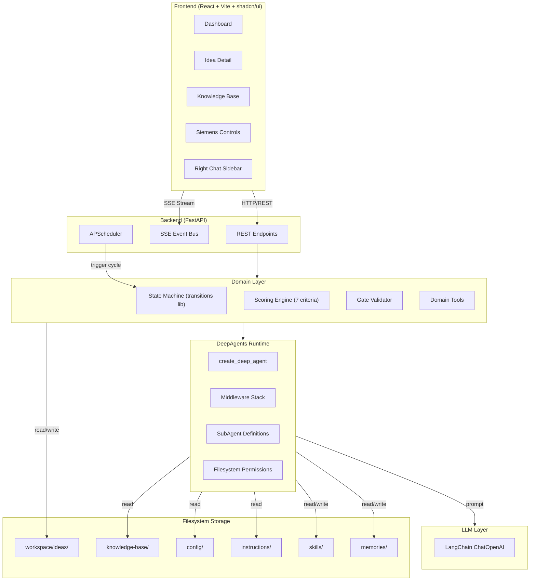
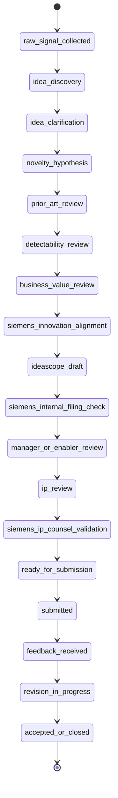
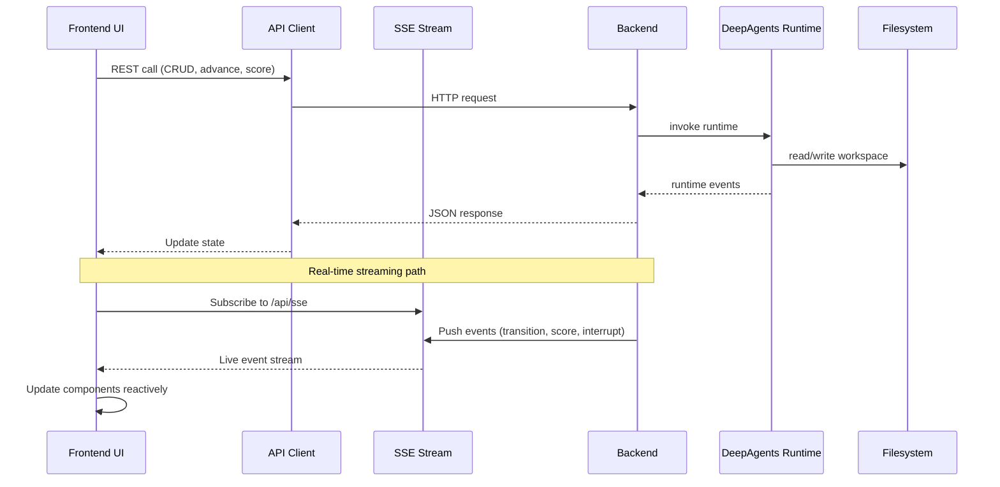

# Architecture

> **Last updated: 2026-07-29**

## 1. System Overview

The Siemens Patent Ideator is a multi-agent autonomous patent pipeline built on the LangChain DeepAgents runtime. It discovers patentable ideas from a knowledge base, processes them through 18 sequential workflow states with 11 specialized AI agents, scores them across 7 weighted criteria, validates against gate checklists, and produces submission-ready patent packets.

### 1.1 Architecture Principles

| Principle | Description |
| ----------- | ------------- |
| **Bounded runtime** | DeepAgents handles planning, delegation, research, drafting, and HITL. Domain layer owns business rules, gate policies, and source-of-truth artifacts. |
| **Single responsibility** | Small files with one job. Route files < 150 lines, services < 200 lines, agent runtime < 200 lines. |
| **Explicit trust** | Every artifact carries provenance metadata. No silent fallback to fabricated output. |
| **Stable contracts** | Keep current behavior stable while changing internals. Backend and frontend contracts align before runtime switches. |
| **No sandbox execution** | Shell execution and code runners are explicitly deferred. |

### 1.2 High-Level Architecture



## 2. Backend Architecture

### 2.1 Directory Structure

```
backend/app/
├── main.py                          # FastAPI entry point → create_app()
├── config.py                        # Settings, directory paths (Pydantic Settings)
├── scheduler.py                     # APScheduler autonomous cycles
│
├── api/
│   ├── app.py                       # FastAPI app factory
│   ├── deps.py                      # Dependency injection
│   └── routes/
│       ├── health.py                # Health check endpoint
│       ├── ideas.py                 # Idea CRUD endpoints
│       ├── workflow.py              # Workflow advancement endpoints
│       ├── config.py                # Configuration endpoints
│       ├── comments.py              # Comment endpoints
│       ├── streaming.py             # SSE streaming endpoint
│       └── chat.py                  # Chat + transcript endpoints
│
├── agent/
│   ├── __init__.py
│   ├── runtime.py                   # get_deep_agent_runtime() factory
│   ├── backends.py                  # CompositeBackend configuration
│   ├── permissions.py               # FilesystemPermission rules
│   ├── context.py                   # DeepAgentContext (Pydantic)
│   ├── subagents.py                 # SubAgent definitions from workflow roles
│   ├── runner.py                    # execute_deep_agent_workflow()
│   └── domain_tools.py              # First-class domain tools
│
├── models/
│   ├── idea.py                      # WorkflowState enum, IdeaRecord, ScoreBreakdown
│   ├── transcript.py                # TranscriptEvent, TranscriptEventType, TranscriptRole
│   └── siemens.py                   # Siemens-specific models
│
├── state/
│   ├── machine.py                   # PatentWorkflowMachine (transitions FSM)
│   ├── definitions.py               # TRANSITIONS, agent_for_state, gate_name_for_transition
│   └── gates.py                     # check_evidence() logic
│
├── scoring/
│   ├── engine.py                    # ScoringEngine, compute_composite()
│   └── criteria.py                  # CriterionEvaluator
│
├── orchestrator/
│   ├── workflow.py                  # run_generation_cycle, run_full_pipeline
│   ├── workflow_tools.py            # create_idea, advance_workflow, score_idea, etc.
│   └── subagents/
│       └── definitions.py           # ALL_SUBAGENTS list
│
├── llm/
│   ├── client.py                    # ChatOpenAI wrapper, call_llm(), call_llm_json()
│   ├── subagent_executor.py         # execute_autonomous_idea_generation, run_subagent
│   └── execution_support.py         # Context loading, prompt building helpers
│
├── storage/
│   ├── yaml_io.py                   # Compatibility shim (re-exports)
│   ├── base.py                      # read_yaml, write_yaml, read_markdown, write_markdown
│   ├── idea_workspace.py            # Idea folder CRUD, transcript events, interrupts
│   ├── registry.py                  # Idea registry (ideas.yaml)
│   ├── knowledge_base.py            # KB document loading
│   ├── artifacts.py                 # Artifact revision tracking, diff building
│   └── recovery.py                  # Filesystem recovery
│
├── research/
│   └── adapters.py                  # search_prior_art, search_filing_sources
│
├── infrastructure/
│   ├── observability.py             # LangSmith tracing configuration
│   └── events/
│       └── stream_bus.py            # SSE event bus
│
└── application/
    └── queries/
        └── get_idea.py              # Idea query helpers
```

### 2.2 DeepAgents Runtime Configuration

#### Runtime Factory (`agent/runtime.py`)

```python
def get_deep_agent_runtime():
    from deepagents import create_deep_agent
    from langgraph.checkpoint.memory import InMemorySaver

    return create_deep_agent(
        model=settings.deepagents_model,
        system_prompt=_load_system_prompt(),
        backend=build_agent_backend(),
        permissions=build_agent_permissions(),
        subagents=build_agent_subagents(),
        context_schema=DeepAgentContext,
        interrupt_on={
            "write_file": True,
            "edit_file": True,
            "delete": True,
        },
        checkpointer=InMemorySaver(),
        name="siemens-patent-ideator",
    )
```

#### Backend Configuration (`agent/backends.py`)

```python
CompositeBackend(
    default=StateBackend(),
    routes={
        "/workspace/": FilesystemBackend(root_dir=WORKSPACE_DIR, virtual_mode=True),
        "/kb/": FilesystemBackend(root_dir=KNOWLEDGE_BASE_DIR, virtual_mode=True),
        "/instructions/": FilesystemBackend(root_dir=INSTRUCTIONS_DIR, virtual_mode=True),
        "/memories/": FilesystemBackend(root_dir=MEMORIES_DIR, virtual_mode=True),
        "/skills/": FilesystemBackend(root_dir=SKILLS_DIR, virtual_mode=True),
    },
)
```

#### Permissions Model (`agent/permissions.py`)

| Path | Read | Write | Interrupt | Deny |
| ------ | ------ | ------- | ----------- | ------ |
| `/workspace/**` | ✅ | ✅ | — | — |
| `/workspace/submissions/**` | ✅ | — | ✅ | — |
| `/workspace/final/**` | ✅ | — | ✅ | — |
| `/memories/**` | ✅ | ✅ | — | — |
| `/kb/**` | ✅ | — | — | ✅ |
| `/instructions/**` | ✅ | — | — | ✅ |
| `/skills/**` | ✅ | — | — | ✅ |
| `/**` (external) | — | — | — | ✅ |

#### Middleware Stack

Expected DeepAgents middleware order:

1. **TodoListMiddleware** — Task planning and progress tracking
2. **SkillsMiddleware** — Skill file loading
3. **FilesystemMiddleware** — With permissions applied
4. **SubAgentMiddleware** — Subagent delegation
5. **SummarizationMiddleware** — Context window management
6. **PatchToolCallsMiddleware** — Tool call patching
7. **Custom Audit Middleware** — Event auditing
8. **MemoryMiddleware** — Long-term memory
9. **HumanInTheLoopMiddleware** — Approval interrupts

### 2.3 State Machine

#### 18 Workflow States (6 Phases)

| # | State | Phase | Agent |
| --- | ------- | ------- | ------- |
| 1 | `raw_signal_collected` | Discovery | knowledge-curator |
| 2 | `idea_discovery` | Discovery | idea-discoverer |
| 3 | `idea_clarification` | Discovery | problem-framer |
| 4 | `novelty_hypothesis` | Research | novelty-analyst |
| 5 | `prior_art_review` | Research | prior-art-researcher |
| 6 | `detectability_review` | Research | detectability-analyst |
| 7 | `business_value_review` | Analysis | business-value-analyst |
| 8 | `siemens_innovation_alignment` | Analysis | siemens-alignment |
| 9 | `ideascope_draft` | Drafting | patent-drafter |
| 10 | `siemens_internal_filing_check` | Drafting | checklist-validator |
| 11 | `manager_or_enabler_review` | Review | reviewer-summarizer |
| 12 | `ip_review` | Review | reviewer-summarizer |
| 13 | `siemens_ip_counsel_validation` | Review | checklist-validator |
| 14 | `ready_for_submission` | Done | reviewer-summarizer |
| 15 | `submitted` | Done | knowledge-curator |
| 16 | `feedback_received` | Done | knowledge-curator |
| 17 | `revision_in_progress` | Done | patent-drafter |
| 18 | `accepted_or_closed` | Done | knowledge-curator |

#### State Transition Diagram



### 2.4 Scoring Engine

#### 7 Weighted Criteria

| Criterion | Weight | Description |
| ----------- | -------- | ------------- |
| novelty | 25% | How novel vs. existing prior art |
| siemens_alignment | 15% | Siemens strategic alignment |
| technical_feasibility | 15% | Technical achievability |
| detectability | 10% | Infringement detectability |
| business_value | 15% | Siemens-specific business value |
| originality | 10% | Non-obviousness |
| completeness | 10% | Documentation completeness |

#### Composite Score Formula

```
composite = Σ(score × weight) for all 7 criteria
```

#### Strength Ratings

| Composite | Rating | Action |
| ----------- | -------- | -------- |
| ≥ 85 | Very Strong | Fast-track Siemens filing |
| ≥ 70 | Strong | Auto-promote to drafting |
| ≥ 50 | Moderate | Route for improvement pass |
| ≥ 30 | Weak | Hold for significant improvement |
| < 30 | Reject | Archive with learning |

### 2.5 Gate Checklists

Each transition has a gate checklist defined in `config/checklist-config.yaml`. The `_check_evidence()` method validates field presence in `idea.yaml` against checklist requirements. Key gates:

| Gate | Items | Key Checks |
| ------ | ------- | ------------ |
| discovery → clarification | 3 | Signal coherent, ≥2 sources, problem identifiable |
| prior_art → detectability | 3 | ≥10 prior art refs, gap analysis, differentiating features |
| drafting → filing_check | 7 | All fields complete, co-inventors, ≥3 prior art, no leak |
| filing_check → manager | 4 | IdeaScope complete, checklist passes, composite ≥70 |

### 2.6 Transcript Event Model

Typed event system defined in `models/transcript.py`:

```python
class TranscriptEventType(str, Enum):
    thinking = "thinking"
    tool_call = "tool_call"
    tool_result = "tool_result"
    subagent = "subagent"
    handover = "handover"
    interrupt = "interrupt"
    approval = "approval"
    retry = "retry"
    failed = "failed"
    completion = "completion"
    done = "done"
    token = "token"
    tasks_update = "tasks_update"
    transition = "transition"
    user_message = "user_message"

class TranscriptRole(str, Enum):
    user = "user"
    orchestrator = "orchestrator"
    subagent = "subagent"
    reviewer = "reviewer"
    tool = "tool"
    workflow = "workflow"
    system = "system"
```

### 2.7 API Endpoints

| Method | Endpoint | Purpose |
| -------- | ---------- | --------- |
| GET | `/api/health` | Health check |
| GET | `/api/sse` | SSE stream |
| GET | `/api/ideas` | List ideas |
| GET | `/api/ideas/{id}` | Get idea detail |
| POST | `/api/ideas` | Create idea |
| POST | `/api/ideas/{id}/advance` | Advance workflow |
| POST | `/api/ideas/{id}/score` | Score idea |
| POST | `/api/ideas/{id}/validate-gate` | Run gate checklist |
| POST | `/api/ideas/{id}/chat` | Post chat message |
| POST | `/api/ideas/{id}/chat/stream` | Stream chat |
| GET | `/api/agent-tasks` | Get agent tasks |
| GET | `/api/workflow/interrupts` | List pending interrupts |
| POST | `/api/workflow/{id}/approve` | Approve interrupt |
| POST | `/api/workflow/{id}/reject` | Reject interrupt |
| GET | `/api/workflow/analytics` | Review analytics |
| POST | `/api/workflow/cycle` | Trigger generation cycle |
| POST | `/api/workflow/seed` | Seed autonomous ideas |
| GET | `/api/stats` | System statistics |

## 3. Frontend Architecture

### 3.1 Directory Structure

```
frontend/src/
├── main.tsx                         # Entry point
├── App.tsx                          # Router, sidebar layout
├── index.css                        # Tailwind + shadcn/ui styles
│
├── api/
│   ├── client.ts                    # REST API client
│   └── deepagents.ts                # DeepAgents-specific API
│
├── components/
│   ├── ui/                          # shadcn/ui components (button, card, dialog, etc.)
│   ├── app-sidebar.tsx              # Left navigation sidebar
│   ├── site-header.tsx              # Top header bar
│   ├── RightChatSidebar.tsx         # Live transcript sidebar
│   ├── IdeaHistoryTimeline.tsx      # Historical timeline
│   ├── deepagents/
│   │   ├── AgentTodoPanel.tsx       # Agent task/progress panel
│   │   ├── SubagentActivityCard.tsx # Subagent activity display
│   │   ├── ToolCallTimeline.tsx     # Tool call inspection
│   │   ├── InterruptInbox.tsx       # Approval interrupt inbox
│   │   └── ArtifactDiffPanel.tsx    # Artifact diff viewer
│   ├── ideas/
│   │   ├── IdeaCard.tsx             # Idea summary card
│   │   ├── ScoreRadar.tsx           # Score radar chart
│   │   └── WorkflowTimeline.tsx     # Workflow state timeline
│   └── workflow/
│       └── ...
│
├── hooks/
│   ├── useDeepAgentStream.ts        # SSE stream hook
│   └── useInterrupts.ts             # Interrupt polling hook
│
├── lib/
│   └── utils.ts                     # Utility functions
│
├── pages/
│   ├── Dashboard.tsx                # Main dashboard
│   ├── IdeaDetail.tsx               # Full idea detail view
│   ├── KnowledgeBase.tsx            # KB browser
│   └── SiemensControls.tsx          # Siemens-specific controls
│
└── types/
    └── deepagents.ts                # DeepAgents type definitions
```

### 3.2 Component Hierarchy

```
App
├── SidebarProvider
│   ├── AppSidebar (left nav)
│   ├── SidebarInset
│   │   ├── SiteHeader
│   │   └── main (Routes)
│   │       ├── Dashboard
│   │       │   ├── IdeaCard[]
│   │       │   └── StatsPanel
│   │       ├── IdeaDetail
│   │       │   ├── IdeaInfo
│   │       │   ├── WorkflowTimeline
│   │       │   ├── ScoreRadar
│   │       │   ├── IdeaHistoryTimeline
│   │       │   ├── ArtifactDiffPanel
│   │       │   └── DeepAgents components
│   │       ├── KnowledgeBase
│   │       └── SiemensControls
│   └── RightChatSidebar
│       ├── AgentTodoPanel
│       ├── SubagentActivityCard[]
│       ├── ToolCallTimeline
│       └── InterruptInbox
```

### 3.3 Data Flow



## 4. Data Model

### 4.1 Per-Idea File Structure

```
workspace/ideas/IDEA-XXXX/
├── idea.yaml              # Main record (title, state, fields, evidence, reviews)
├── state.yaml             # State machine history, current state, phase
├── scores.yaml            # Score history array + latest snapshot
├── transcript.yaml        # Typed transcript events
├── ideascope-draft.md     # Human-readable IdeaScope document
├── submission-summary.md  # Final submission packet
├── handovers/             # Per-transition handover packets
│   ├── idea_discovery-to-idea_clarification.md
│   └── ...
└── revisions/
    └── changelog.md       # Chronological transition log
```

### 4.2 Key Models

**IdeaRecord** (`models/idea.py`):

- `idea_id`, `title`, `current_state` (WorkflowState), `phase`
- `signal_text`, `problem_statement`, `solution_concept`
- `siemens_domain`, `siemens_business_unit`
- `state_history[]`, `scores[]`, `latest_composite`
- `source_evidence[]`, `tags[]`
- `created_at`, `updated_at`, `priority`, `paused_processing`

**TranscriptEvent** (`models/transcript.py`):

- `id`, `idea_id`, `type` (TranscriptEventType), `timestamp`
- `speaker`, `role` (TranscriptRole), `agent`
- `content`, `tool`, `params`, `output`
- `from_agent`, `to_agent`, `interrupt_id`
- `decision`, `reason`, `provenance`, `trust`

## 5. Deployment

### 5.1 Docker Services

| Service | Port | Image | Volumes |
|---------|------|-------|---------|
| backend | 8000 | Custom (FastAPI) | config (ro), instructions (ro), workspace (rw), knowledge-base (rw) |
| frontend | 3000 | Custom (Nginx + Vite) | Build-time only |

### 5.2 Environment Variables

| Variable | Default | Purpose |
| ---------- | --------- | --------- |
| `OPENAI_API_KEY` | — | OpenAI-compatible API key |
| `OPENAI_API_BASE` | `https://api.openai.com/v1` | LLM API base URL |
| `OPENAI_MODEL_NAME` | `gpt-4o` | LLM model name |
| `DEEPAGENTS_MODEL` | `openai:{model}` | DeepAgents model spec (auto-derived) |
| `LANGSMITH_API_KEY` | — | LangSmith tracing key |
| `LANGSMITH_PROJECT` | `ideator` | LangSmith project name |
| `APP_ROOT_DIR` | Auto-detected | Root directory (pinned in Docker) |

> **⚠️ Credential Propagation**: The `.env` file is read by `pydantic-settings` into the `Settings` object. However, LangChain's `init_chat_model()` (called internally by `create_deep_agent`) reads credentials from standard OS environment variables (`OPENAI_API_KEY`, `OPENAI_API_BASE`), NOT from pydantic-settings. The `config.py` module automatically propagates credentials to `os.environ` at import time so the DeepAgents runtime can authenticate. If you set credentials at runtime, ensure they are set as OS environment variables before importing any LangChain or DeepAgents modules.

## 6. Trust and Failure Model

### 6.1 Trust Levels

| Trust Level | Description | Source |
| ------------- | ------------- | -------- |
| `trusted` | Human-verified or system-confirmed | User input, approval decisions, tool results |
| `verified-tool-call` | Tool call was dispatched and returned | Runtime tool execution |
| `generated` | LLM-generated content, not yet verified | Agent reasoning, drafts |
| `fallback` | Used when primary path failed | Heuristic fallback, retry output |

### 6.2 Failure States

The UI exposes these states explicitly:

- **retry required** — A step failed but can be retried
- **agent failed** — An agentic step failed permanently
- **human approval required** — Workflow paused for human decision
- **evidence insufficient** — Gate check failed due to missing evidence
- **fallback prohibited** — No fallback path exists for this step

## 7. Related Documents

- [UI Design](./ui-design.md) — Frontend component design and design system
- [PRD](./prd.md) — Product requirements and user stories
- [Product Context](./product-context.md) — Business context and personas
- [Features](./features.md) — Complete feature tree
- [Coding Guidelines](./coding-guidelines.md) — Development standards
- [Code Review Guidelines](./code-review-guidelines.md) — Code review checklist and process
- [Architecture Decisions](./architecture-decisions.md) — ADR log
- [Tasks](./tasks.md) — Implementation task hierarchy
