# Siemens Patent Ideator — Complete Workflow Documentation

> **TL;DR**: An autonomous, LLM-powered patent idea generation and validation system for Siemens. It discovers patentable ideas from a knowledge base, processes them through 18 workflow states with 11 specialized AI agents, scores them across 7 weighted criteria, validates against gate checklists, and produces submission-ready patent packets — all without external patent APIs.

---

## Table of Contents

1. [System Overview](#1-system-overview)
2. [Architecture](#2-architecture)
3. [Workflow States & Transitions](#3-workflow-states--transitions)
4. [Agents & Responsibilities](#4-agents--responsibilities)
5. [Scoring Engine](#5-scoring-engine)
6. [Gate Checklists & Guardrails](#6-gate-checklists--guardrails)
7. [Data Flow & Persistence](#7-data-flow--persistence)
8. [API Endpoints](#8-api-endpoints)
9. [Scheduler & Automation](#9-scheduler--automation)
10. [Configuration](#10-configuration)
11. [Mermaid Diagrams](#11-mermaid-diagrams)

---

## 1. System Overview

### What It Does

The Siemens Patent Ideator is a **multi-agent autonomous patent pipeline** that:

1. **Discovers** patentable ideas from a knowledge base or user-provided signals
2. **Strengthens** each idea through 18 sequential workflow states
3. **Validates** against Siemens strategic domains and gate checklists
4. **Scores** across 7 weighted patentability criteria (0–100 composite)
5. **Drafts** complete IdeaScope invention disclosure documents
6. **Simulates** manager review, IP review, and IP counsel validation
7. **Produces** submission-ready patent filing packets

### Core Principles

| Principle | Description |
|-----------|-------------|
| **Systematic** | Follows 18 workflow states strictly. Never skips a state or gate. |
| **Thorough** | Each gate has a checklist. Every item must pass before advancing. |
| **Transparent** | All findings, scores, and decisions documented in YAML and Markdown. |
| **Proactive** | Continuously improves ideas below threshold via autonomous scheduler. |
| **Siemens-Aware** | All ideas evaluated against Siemens strategic domains and portfolio. |

### Key Constraints

- **No external patent APIs** — Prior art reasoning uses LLM training knowledge + curated knowledge base
- **LLM-powered** — Every state transition invokes a domain-specific LLM prompt
- **File-based persistence** — All state stored as YAML/Markdown in `workspace/`
- **SSE real-time** — Dashboard gets live updates via Server-Sent Events

---

## 2. Architecture

### System Architecture Diagram

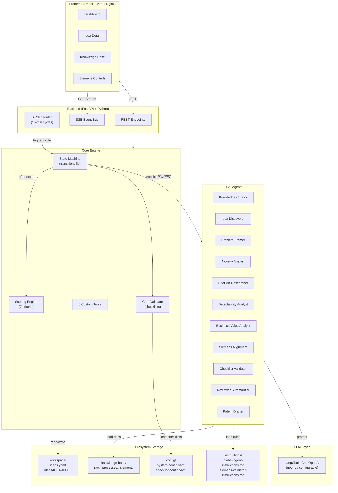

### Component Breakdown

| Component | Technology | Purpose |
|-----------|-----------|---------|
| **Frontend** | React 18 + TypeScript + Vite + Tailwind + shadcn/ui | Dashboard, idea detail, real-time SSE updates |
| **Backend** | FastAPI + Python 3.13 | REST API, SSE streaming, orchestration |
| **State Machine** | `transitions` library | 18-state FSM with lifecycle hooks per idea |
| **LLM Client** | LangChain `ChatOpenAI` | JSON-structured LLM calls with retry logic |
| **Scheduler** | APScheduler `AsyncIOScheduler` | Autonomous workflow cycles every 15 minutes |
| **Storage** | YAML + Markdown files | All persistence is file-based in `workspace/` |
| **Containerization** | Docker Compose | Backend (port 8000) + Frontend/Nginx (port 3000) |

### Directory Structure

```
ideator/
├── docker-compose.yml              # Backend + Frontend services
├── workflow.md                     # This file
├── backend/
│   ├── Dockerfile
│   ├── requirements.txt
│   └── app/
│       ├── main.py                 # FastAPI entry point, REST + SSE
│       ├── config.py               # Settings, directory paths
│       ├── scheduler.py            # APScheduler autonomous cycles
│       ├── llm/
│       │   ├── client.py           # LangChain ChatOpenAI wrapper
│       │   └── subagent_executor.py # 14 state-specific LLM executors
│       ├── models/
│       │   └── idea.py             # WorkflowState enum, Pydantic models
│       ├── state/
│       │   └── machine.py          # PatentWorkflowMachine (FSM)
│       ├── scoring/
│       │   ├── engine.py           # 7-criterion weighted scoring
│       │   └── criteria.py         # LLM-powered criterion evaluator
│       ├── orchestrator/
│       │   ├── workflow.py         # run_generation_cycle, run_full_pipeline
│       │   ├── workflow_tools.py    # 8 custom tools (create, advance, score...)
│       │   └── subagents/
│       │       └── definitions.py  # 11 SubAgentDef definitions
│       └── storage/
│           └── idea_workspace.py    # Filesystem YAML/Markdown I/O
├── frontend/
│   ├── Dockerfile
│   ├── nginx.conf
│   └── src/
│       ├── App.tsx                 # Router, sidebar layout
│       ├── pages/
│       │   ├── Dashboard.tsx       # Main dashboard with stats + ideas
│       │   ├── IdeaDetail.tsx      # Full idea view with tabs
│       │   ├── KnowledgeBase.tsx   # KB document browser
│       │   └── SiemensControls.tsx # Siemens-specific controls
│       └── components/             # IdeaCard, ScoreRadar, WorkflowTimeline...
├── config/
│   ├── system-config.yaml          # Weights, thresholds, intervals
│   └── checklist-config.yaml       # Gate checklists per transition
├── instructions/
│   ├── global-agent-instructions.md
│   └── siemens-validator-instructions.md
├── knowledge-base/
│   ├── raw/                        # Source documents
│   ├── processed/                  # Processed documents
│   ├── learning-memory/            # Agent learning memory
│   └── siemens/
│       └── tech_domains.yaml       # Siemens strategic domains
└── workspace/
    ├── ideas.yaml                  # Idea registry
    └── ideas/
        └── IDEA-XXXX/
            ├── idea.yaml           # Main idea record
            ├── state.yaml          # State machine history
            ├── scores.yaml         # Score history + latest
            ├── ideascope-draft.md  # Drafted IdeaScope document
            ├── submission-summary.md
            ├── handovers/          # Per-transition handover packets
            └── revisions/          # Changelog
```

---

## 3. Workflow States & Transitions

### The 18 States (6 Phases)

| # | State | Phase | Agent | Description |
|---|-------|-------|-------|-------------|
| 1 | `raw_signal_collected` | Discovery | knowledge-curator | Raw signal/observation captured |
| 2 | `idea_discovery` | Discovery | idea-discoverer | Signal processed into structured idea |
| 3 | `idea_clarification` | Discovery | problem-framer | Problem statement refined with technical context |
| 4 | `novelty_hypothesis` | Research | novelty-analyst | Novelty claims articulated, search terms defined |
| 5 | `prior_art_review` | Research | prior-art-researcher | Prior art evaluated using LLM knowledge |
| 6 | `detectability_review` | Research | detectability-analyst | Infringement detectability assessed |
| 7 | `business_value_review` | Analysis | business-value-analyst | Siemens business value quantified |
| 8 | `siemens_innovation_alignment` | Analysis | siemens-alignment | Strategic domain alignment validated |
| 9 | `ideascope_draft` | Drafting | patent-drafter | IdeaScope invention disclosure drafted |
| 10 | `siemens_internal_filing_check` | Drafting | checklist-validator | Internal filing compliance checked |
| 11 | `manager_or_enabler_review` | Review | reviewer-summarizer | Manager review packet created |
| 12 | `ip_review` | Review | reviewer-summarizer | IP attorney review simulated |
| 13 | `siemens_ip_counsel_validation` | Review | checklist-validator | Final IP counsel validation |
| 14 | `ready_for_submission` | Done | reviewer-summarizer | Submission-ready packet generated |
| 15 | `submitted` | Done | knowledge-curator | Filed externally |
| 16 | `feedback_received` | Done | knowledge-curator | Office action or feedback received |
| 17 | `revision_in_progress` | Done | patent-drafter | Responding to feedback |
| 18 | `accepted_or_closed` | Done | knowledge-curator | Final disposition |

### State Transition Diagram

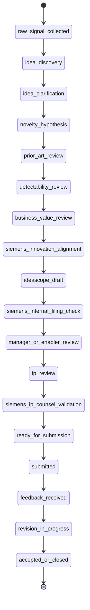

### Transition Triggers & Gates

| From | To | Trigger | Gate Checklist |
|------|-----|---------|----------------|
| raw_signal_collected | idea_discovery | `advance_to_idea_discovery` | None (auto-pass) |
| idea_discovery | idea_clarification | `advance_to_idea_clarification` | signal_coherent, min_sources (≥2), problem_identifiable |
| idea_clarification | novelty_hypothesis | `advance_to_novelty_hypothesis` | technical_context, solution_direction, siemens_domain |
| novelty_hypothesis | prior_art_review | `advance_to_prior_art_review` | novelty_claims_testable, search_terms (≥5), patent_classes |
| prior_art_review | detectability_review | `advance_to_detectability_review` | prior_art_examined (≥10 refs), novelty_gap_analysis, differentiating_features |
| detectability_review | business_value_review | `advance_to_business_value_review` | observability_evaluated, detection_method, non_obviousness_drafted |
| business_value_review | siemens_innovation_alignment | `advance_to_siemens_alignment` | business_value_minimum (≥40), siemens_unit_identified, market_impact |
| siemens_innovation_alignment | ideascope_draft | `advance_to_ideascope_draft` | strategic_alignment (≥1 area), business_units_identified, no_portfolio_conflict, competitive_advantage, trl_estimated |
| ideascope_draft | siemens_internal_filing_check | `advance_to_siemens_filing_check` | mandatory_fields_complete, co_inventors_identified, prior_art_attached (≥3), no_confidential_leak, business_benefit_quantified, detectability_complete, source_evidence_preserved |
| siemens_internal_filing_check | manager_or_enabler_review | `advance_to_manager_review` | ideascope_complete, filing_checklist_passes, scoring_minimum (≥70), no_gate_below_threshold (≥50%) |
| manager_or_enabler_review | ip_review | `advance_to_ip_review` | manager_signoff, manager_comments, resource_commitment |
| ip_review | siemens_ip_counsel_validation | `advance_to_counsel_validation` | ip_reviewer_assigned, patentability_opinion, filing_jurisdiction, international_considerations |
| siemens_ip_counsel_validation | ready_for_submission | `advance_to_ready` | patentability_confirmed, filing_strategy, committee_signoff, counsel_approval |
| ready_for_submission | submitted | `advance_to_submitted` | None (auto-pass) |
| submitted | feedback_received | `advance_to_feedback` | None (auto-pass) |
| feedback_received | revision_in_progress | `advance_to_revision` | None (auto-pass) |
| revision_in_progress | accepted_or_closed | `advance_to_accepted` | None (auto-pass) |

### State Machine Lifecycle Hooks

Each transition fires **three hooks**:

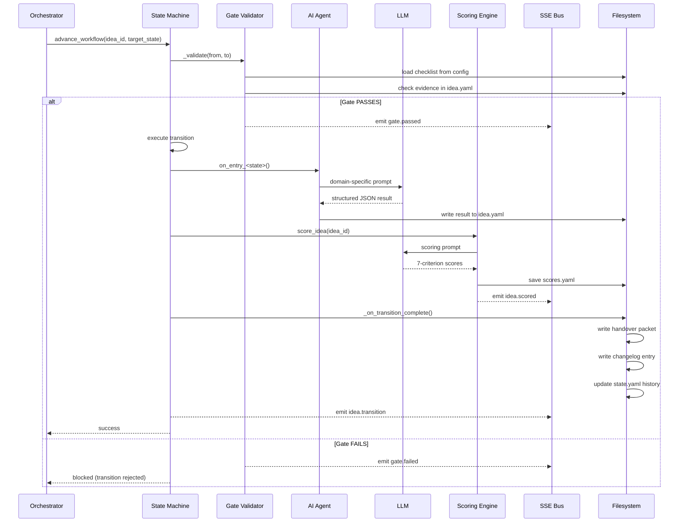

---

## 4. Agents & Responsibilities

### 11 AI Agents

| Agent | States | Tools | Role |
|-------|--------|-------|------|
| **knowledge-curator** | raw_signal_collected, submitted, feedback_received, accepted_or_closed | create_idea, update_idea_field | Ingests documents, extracts signals from KB |
| **idea-discoverer** | idea_discovery | create_idea, update_idea_field | Transforms raw signals into structured ideas |
| **problem-framer** | idea_clarification | update_idea_field | Refines problem statements with technical context |
| **novelty-analyst** | novelty_hypothesis | update_idea_field | Articulates novelty claims, defines search terms |
| **prior-art-researcher** | prior_art_review | add_evidence, update_idea_field | Searches and analyzes prior art references |
| **detectability-analyst** | detectability_review | update_idea_field | Evaluates infringement detectability |
| **business-value-analyst** | business_value_review | score_idea, update_idea_field | Quantifies Siemens business value |
| **siemens-alignment** | siemens_innovation_alignment | score_idea, update_idea_field | Validates strategic domain alignment |
| **checklist-validator** | siemens_internal_filing_check, siemens_ip_counsel_validation | validate_gate, score_idea | Gatekeeper — validates checklists |
| **reviewer-summarizer** | manager_or_enabler_review, ip_review, ready_for_submission | score_idea, validate_gate | Creates review packets for humans |
| **patent-drafter** | ideascope_draft, revision_in_progress | update_idea_field | Drafts IdeaScope documents |

### Agent Flow Diagram

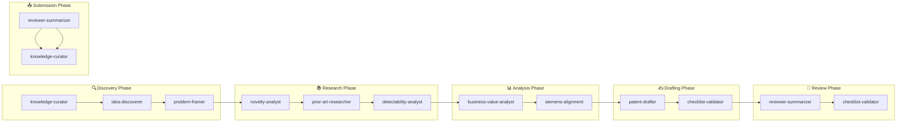

### 8 Custom Tools

| Tool | Signature | Purpose |
|------|-----------|---------|
| `create_idea` | `(signal_text, title)` | Creates idea folder, registry entry, FSM machine |
| `advance_workflow` | `(idea_id, target_state)` | Executes state transition with gate validation |
| `score_idea` | `(idea_id, agent_name)` | Runs 7-criterion LLM scoring |
| `validate_gate` | `(idea_id, gate_name)` | Runs specific gate checklist |
| `update_idea_field` | `(idea_id, field, value)` | Updates idea.yaml field + registry |
| `add_evidence` | `(idea_id, source, content)` | Adds source evidence entry |
| `write_handover` | `(idea_id, from, to, summary, findings, recommendations)` | Writes handover packet |
| `advance_to_next_state` | `(idea_id)` | Auto-advances to first available next state |

---

## 5. Scoring Engine

### 7 Weighted Criteria

| Criterion | Weight | Label | Description |
|-----------|--------|-------|-------------|
| **novelty** | 25% | Novelty (Prior-Art Gap) | How novel vs. existing prior art? |
| **siemens_alignment** | 15% | Siemens Strategic Alignment | How well does it align with Siemens strategy? |
| **technical_feasibility** | 15% | Technical Feasibility | Is the solution technically achievable? |
| **detectability** | 10% | Detectability | Can infringement be detected? |
| **business_value** | 15% | Business Value (Siemens-specific) | What is the business/market value? |
| **originality** | 10% | Originality (Non-Obviousness) | Is it non-obvious? |
| **completeness** | 10% | Completeness | How complete is the documentation? |

### Composite Score Formula

```
composite = Σ(score × weight) for all 7 criteria
```

Each criterion scored 0–100. Composite is a weighted sum (0–100).

### Strength Ratings

| Composite | Rating | Action |
|-----------|--------|--------|
| ≥ 85 | **Very Strong** | Fast-track Siemens filing |
| ≥ 70 | **Strong** | Auto-promote to drafting |
| ≥ 50 | **Moderate** | Route for improvement pass |
| ≥ 30 | **Weak** | Hold for significant improvement |
| < 30 | **Reject** | Archive with learning |

### Filing Threshold

An idea meets the filing threshold when:

1. **Composite ≥ 70** AND
2. **No critical criterion below 50%** (novelty, siemens_alignment, completeness)

### Scoring Methods

1. **LLM-powered (primary)**: `execute_llm_scoring()` sends all idea data to LLM with structured prompt
2. **Heuristic fallback**: If LLM fails, uses field presence heuristics

### Score Persistence

Saved to `scores.yaml`:

```yaml
idea_id: IDEA-0001
history:
  - timestamp: "2026-07-26T..."
    composite: 77.2
    breakdown: {novelty: 82, siemens_alignment: 75, ...}
    criteria_detail: {novelty: {score: 82, reasoning: "...", confidence: 90}, ...}
    strength_rating: "Strong"
    summary: "..."
    change_explanation: "..."
    agent_responsible: "scoring-engine"
latest: { ... same structure as last history entry ... }
```

---

## 6. Gate Checklists & Guardrails

### Gate Checklist Summary

| Gate | Items | Key Checks |
|------|-------|------------|
| discovery → clarification | 3 | Signal coherent, ≥2 sources, problem identifiable |
| clarification → novelty | 3 | Technical context, solution direction, Siemens domain |
| novelty → prior_art | 3 | Testable claims, ≥5 search terms, IPC/CPC classes |
| prior_art → detectability | 3 | ≥10 prior art refs, gap analysis, differentiating features |
| detectability → business_value | 3 | Observability evaluated, detection method, non-obviousness |
| business_value → alignment | 3 | Business value ≥40, Siemens unit identified, market impact |
| alignment → drafting | 5 | ≥1 strategic area, BUs identified, no portfolio conflict, competitive advantage, TRL estimated |
| drafting → filing_check | 7 | All fields complete, co-inventors, ≥3 prior art, no leak, benefit quantified, detectability, evidence |
| filing_check → manager | 4 | IdeaScope complete, checklist passes, composite ≥70, no gate <50% |
| manager → ip_review | 3 | Manager signoff, comments, resource commitment |
| ip_review → counsel | 4 | IP reviewer assigned, patentability opinion, jurisdiction, international |
| counsel → ready | 4 | Patentability confirmed, filing strategy, committee signoff, counsel approval |

### Evidence Checking Logic

The `_check_evidence()` method in `PatentWorkflowMachine` uses heuristics:

| Checklist Item | Evidence Check |
|----------------|---------------|
| `signal_coherent` | `idea.yaml` has `signal_text` |
| `min_sources` | `source_evidence` array length ≥ 2 |
| `problem_identifiable` | `idea.yaml` has `problem_statement` |
| `technical_context` | Has `problem_statement` AND `solution_concept` |
| `solution_direction` | Has `problem_statement` AND `solution_concept` |
| `siemens_domain` | `idea.yaml` has `siemens_domain` |
| `search_terms` | Has `title` (placeholder — would check novelty claims) |
| `prior_art_examined` | `source_evidence` array length ≥ 3 |
| `novelty_gap_analysis` | Has `solution_concept` |
| `differentiating_features` | Has `solution_concept` |
| `observability_evaluated` | Has `problem_statement` |
| `detection_method` | Has `solution_concept` |
| `non_obviousness_drafted` | Has `title` |
| `business_value_minimum` | `scores.yaml` composite ≥ 40 |
| `siemens_unit_identified` | Has `siemens_business_unit` |
| `market_impact` | Has `problem_statement` |
| **Default** | Has `title` |

### Siemens Validator Guardrails

The `siemens-alignment` agent evaluates 5 criteria:

1. **Strategic Domain Match** — Maps to Digital Industries, Smart Infrastructure, Mobility, Healthcare, or Financial Services
2. **Business Unit Fit** — Identifies which Siemens BU would own this IP
3. **Portfolio Conflict** — Checks overlap with known Siemens patent families
4. **Competitive Advantage** — Siemens-specific capability advantage
5. **Technology Readiness** — TRL estimate (1–9)

### Siemens Tech Domains

| Domain | Sub-Domains |
|--------|-------------|
| **Digital Industries** | Industrial Automation & Control, PLM Software, Industrial Edge & IoT, Digital Twin, Industrial AI/ML, PROFINET |
| **Smart Infrastructure** | Building Automation, Smart Grid, EV Charging, Low-Voltage Power, Cyber Security |
| **Mobility** | Rail Automation, Rail Electrification, Intelligent Traffic, Rail IoT, Autonomous Train |
| **Healthineers** | Medical Imaging, Diagnostics, Point-of-Care, Digital Health, Molecular Imaging |
| **Financial Services** | Equipment Financing, Digital Payments, Asset Lifecycle, Trade Finance |
| **Cross-Cutting** | Cybersecurity, AI/ML, Digital Twin, Edge Computing, Additive Manufacturing, Sustainable Energy |

---

## 7. Data Flow & Persistence

### Per-Idea File Structure

```
workspace/ideas/IDEA-XXXX/
├── idea.yaml              # Main record (title, state, fields, evidence)
├── state.yaml             # State machine history, current state, phase
├── scores.yaml            # Score history array + latest snapshot
├── ideascope-draft.md     # Human-readable IdeaScope document
├── submission-summary.md  # Final submission packet
├── handovers/             # Per-transition handover packets
│   ├── idea_discovery-to-idea_clarification.md
│   ├── idea_clarification-to-novelty_hypothesis.md
│   └── ...
└── revisions/
    └── changelog.md       # Chronological transition log
```

### Data Flow Sequence

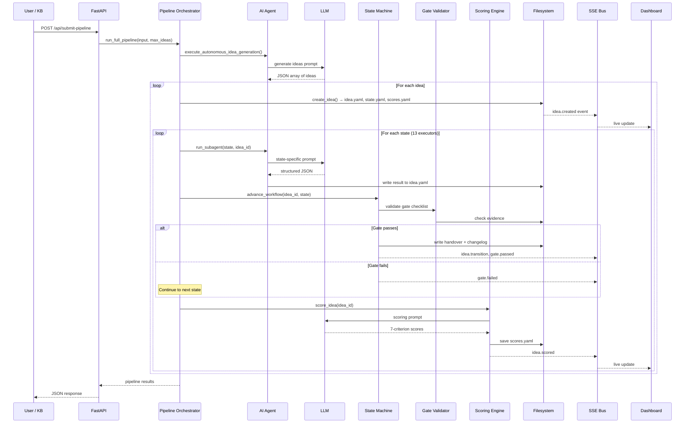

### SSE Event Types

| Event | When | Data |
|-------|------|------|
| `idea.created` | New idea created | idea_id, title, phase, state |
| `idea.transition` | State transition completed | idea_id, from, to, validation |
| `idea.scored` | Scoring completed | idea_id, composite, breakdown, strength_rating |
| `agent.progress` | Agent enters a state | idea_id, message, state |
| `gate.passed` | Gate checklist passed | idea_id, gate, checklist_items, passed |
| `gate.failed` | Gate checklist failed | idea_id, gate, checklist_items, passed, failed |

---

## 8. API Endpoints

### REST API

| Method | Endpoint | Purpose |
|--------|----------|---------|
| GET | `/api/health` | Health check |
| GET | `/api/sse` | SSE stream for real-time events |
| GET | `/api/ideas` | List ideas (filters: phase, state, min_score) |
| GET | `/api/ideas/{id}` | Get full idea details |
| GET | `/api/ideas/{id}/files` | Get all workspace files for an idea |
| POST | `/api/ideas` | Create new idea (autonomous or steered) |
| POST | `/api/ideas/{id}/advance` | Advance to next or specified state |
| POST | `/api/ideas/{id}/score` | Score idea with 7 criteria |
| POST | `/api/ideas/{id}/validate-gate` | Run gate checklist |
| POST | `/api/ideas/{id}/update` | Update idea field |
| POST | `/api/ideas/{id}/evidence` | Add source evidence |
| POST | `/api/workflow/cycle` | Trigger generation cycle |
| POST | `/api/workflow/seed` | Seed with autonomous ideas |
| POST | `/api/submit-pipeline` | Run full autonomous pipeline |
| POST | `/api/workflow/autonomous` | Autonomous pipeline (no user input) |
| POST | `/api/auto-pipeline` | Alias for submit-pipeline |
| GET | `/api/phases` | Get phase groupings |
| GET | `/api/knowledge-base` | Get KB documents |
| GET | `/api/config/siemens-domains` | Get Siemens tech domains |
| GET | `/api/stats` | Get system statistics |

### Pipeline Endpoints (Full Flow)

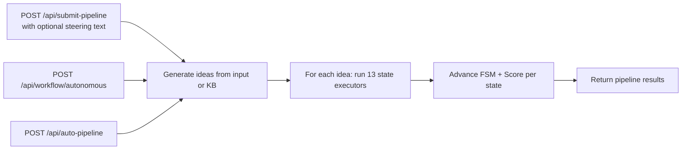

---

## 9. Scheduler & Automation

### Autonomous Scheduler

- **Library**: APScheduler `AsyncIOScheduler`
- **Interval**: 15 minutes (configurable via `workflow.interval_minutes`)
- **Max Instances**: 1 (prevents overlapping cycles)
- **Guard**: Skips if `is_cycle_running()` returns true

### Generation Cycle (`run_generation_cycle`)

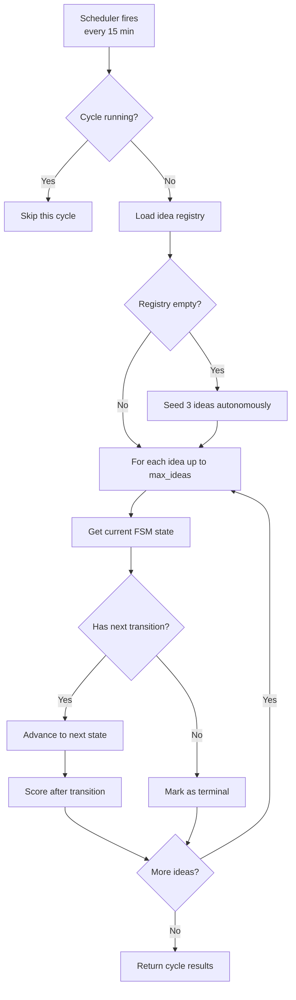

### Full Pipeline (`run_full_pipeline`)

The full pipeline runs **all 13 state executors** sequentially for each idea:

1. Generate ideas (from user input or autonomous KB discovery)
2. For each idea:
   - Score baseline at `raw_signal_collected`
   - Execute each of 13 state executors in order
   - Advance FSM state after each executor
   - Score after each transition
   - Emit SSE events for progress
3. Return pipeline results with per-idea state logs

---

## 10. Configuration

### system-config.yaml

```yaml
workflow:
  interval_minutes: 15        # Scheduler cycle interval
  max_retries_per_state: 3    # Max retries per state
  idle_timeout_minutes: 60    # Idle timeout

scoring:
  composite_threshold: 70     # Minimum composite to file
  gate_threshold_percent: 50  # Minimum per-criterion for gates
  criteria:
    novelty:           {weight: 0.25, label: "Novelty (Prior-Art Gap)"}
    siemens_alignment: {weight: 0.15, label: "Siemens Strategic Alignment"}
    technical_feasibility: {weight: 0.15, label: "Technical Feasibility"}
    detectability:     {weight: 0.10, label: "Detectability"}
    business_value:    {weight: 0.15, label: "Business Value (Siemens-specific)"}
    originality:       {weight: 0.10, label: "Originality (Non-Obviousness)"}
    completeness:      {weight: 0.10, label: "Completeness"}
  strength_ratings:
    very_strong: {min: 85, action: "Fast-track Siemens filing"}
    strong:      {min: 70, action: "Auto-promote to drafting"}
    moderate:    {min: 50, action: "Route for improvement pass"}
    weak:        {min: 30, action: "Hold for significant improvement"}
    reject:      {min: 0,  action: "Archive with learning"}
```

### Environment Variables

| Variable | Default | Purpose |
|----------|---------|---------|
| `openai_api_key` | `sk-placeholder` | OpenAI API key |
| `openai_api_base` | `https://api.openai.com/v1` | LLM API base URL |
| `openai_model_name` | `gpt-4o` | LLM model name |
| `backend_host` | `0.0.0.0` | Backend bind host |
| `backend_port` | `8000` | Backend bind port |
| `APP_ROOT_DIR` | Auto-detected | Root directory (pinned in Docker) |

### Docker Services

| Service | Port | Image | Volumes |
|---------|------|-------|---------|
| **backend** | 8000 | Custom (FastAPI) | config (ro), instructions (ro), workspace (rw), knowledge-base (rw) |
| **frontend** | 3000 | Custom (Nginx + Vite) | Build-time only |

---

## 11. Mermaid Diagrams

### Complete System Architecture

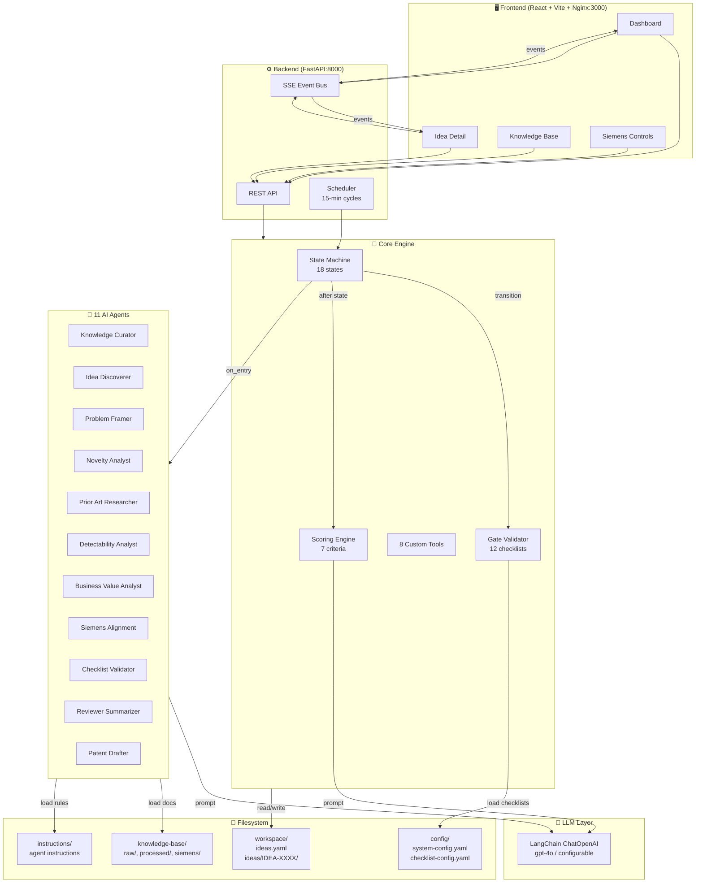

### End-to-End Sequence: User Submits Pipeline

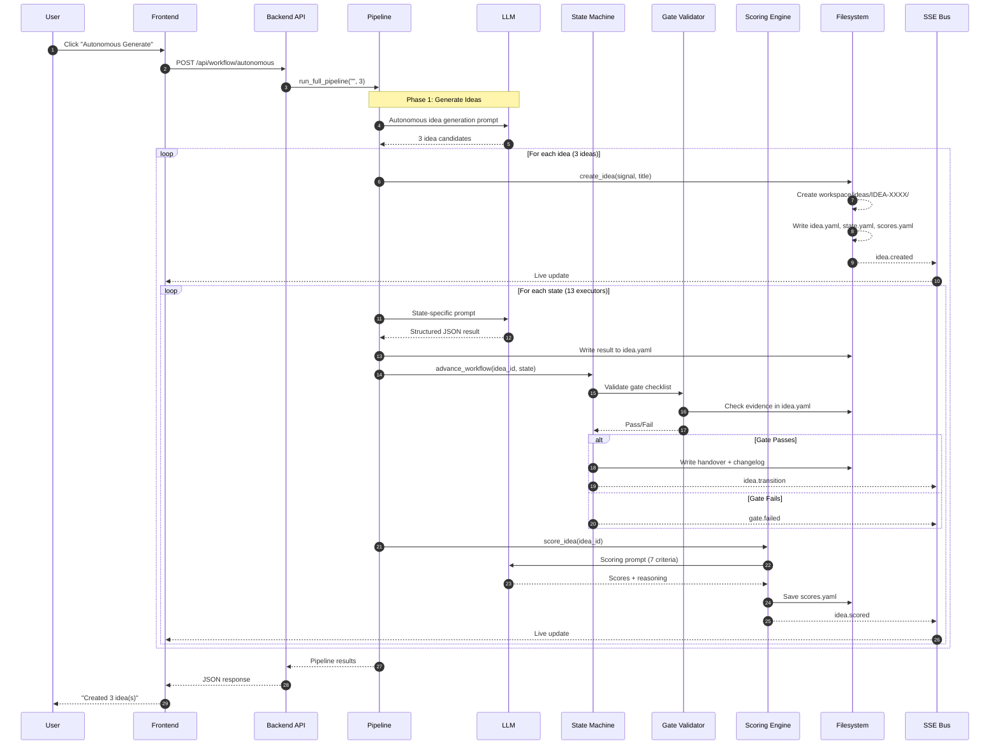

### State Machine with Phases

```mermaid
graph LR
    subgraph Discovery["🔍 Discovery"]
        S1[raw_signal_collected] --> S2[idea_discovery] --> S3[idea_clarification]
    end

    subgraph Research["📚 Research"]
        S4[novelty_hypothesis] --> S5[prior_art_review] --> S6[detectability_review]
    end

    subgraph Analysis["📊 Analysis"]
        S7[business_value_review] --> S8[siemens_innovation_alignment]
    end

    subgraph Drafting["✍️ Drafting"]
        S9[ideascope_draft] --> S10[siemens_internal_filing_check]
    end

    subgraph Review["🔬 Review"]
        S11[manager_or_enabler_review] --> S12[ip_review] --> S13[siemens_ip_counsel_validation]
    end

    subgraph Done["✅ Done"]
        S14[ready_for_submission] --> S15[submitted] --> S16[feedback_received] --> S17[revision_in_progress] --> S18[accepted_or_closed]
    end

    S3 --> S4
    S6 --> S7
    S8 --> S9
    S10 --> S11
    S13 --> S14
```

### Scoring Flow

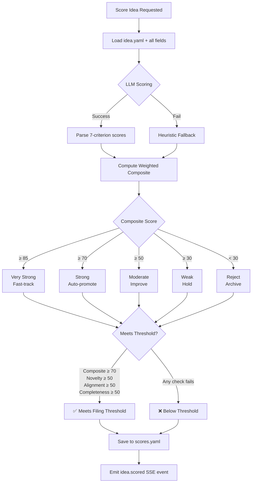

---

## Quick Reference

### How to Start

```bash
# Start everything
docker compose up --build

# Frontend: http://localhost:3000
# Backend:  http://localhost:8000
# API Docs: http://localhost:8000/docs
```

### How to Generate Ideas

1. **Autonomous**: Click "Autonomous Generate" on Dashboard → generates 3 ideas from KB
2. **Steered**: Click "Optional Hint" → provide domain focus → generates targeted ideas
3. **API**: `POST /api/submit-pipeline` with `{input_text: "...", max_ideas: 3}`

### How the Pipeline Works

```
Signal → Create Idea → 13 State Executors → Score → Gate Check → Next State → ... → Submission Ready
```

Each state:

1. **LLM Agent** generates domain-specific content
2. **State Machine** advances (gate must pass)
3. **Scoring Engine** evaluates 7 criteria
4. **SSE** pushes live update to dashboard
5. **Filesystem** persists all artifacts

### Key Files to Watch

| File | What It Tells You |
|------|------------------|
| `workspace/ideas.yaml` | Registry of all ideas |
| `workspace/ideas/IDEA-XXXX/idea.yaml` | Full idea data |
| `workspace/ideas/IDEA-XXXX/state.yaml` | Current state + history |
| `workspace/ideas/IDEA-XXXX/scores.yaml` | Score history + latest |
| `workspace/ideas/IDEA-XXXX/handovers/` | Per-transition handover packets |
| `workspace/ideas/IDEA-XXXX/revisions/changelog.md` | Chronological audit trail |
